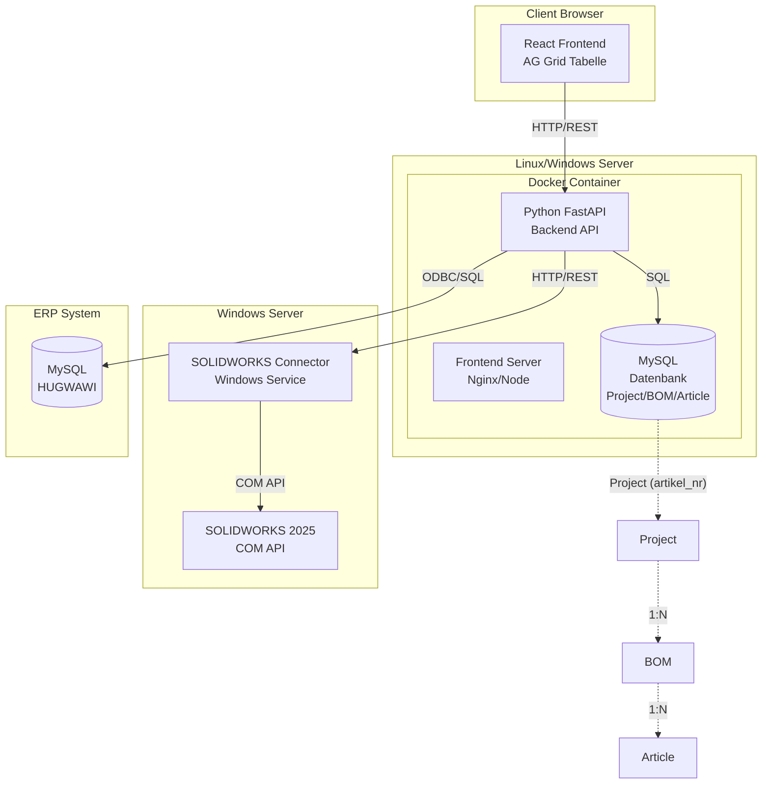

# Umsetzungsplan: Webbasiertes Stücklisten-ERP System

## Architektur-Übersicht

Das System besteht aus vier Hauptkomponenten:



## Projektstruktur

```
00200_HG_SW_Stuecklisten_ERP/
├── backend/
│   ├── app/
│   │   ├── __init__.py
│   │   ├── main.py                 # FastAPI App
│   │   ├── models/                 # SQLAlchemy Models
│   │   │   ├── __init__.py
│   │   │   ├── project.py
│   │   │   ├── bom.py              # BOM Model
│   │   │   ├── article.py
│   │   │   ├── document.py
│   │   │   ├── document_flag.py    # Document Generation Flags
│   │   │   └── order.py
│   │   ├── schemas/                # Pydantic Schemas
│   │   │   ├── __init__.py
│   │   │   ├── project.py
│   │   │   └── article.py
│   │   ├── api/
│   │   │   ├── __init__.py
│   │   │   ├── routes/
│   │   │   │   ├── __init__.py
│   │   │   │   ├── projects.py
│   │   │   │   ├── boms.py          # BOM Routes
│   │   │   │   ├── articles.py
│   │   │   │   ├── documents.py
│   │   │   │   ├── erp.py
│   │   │   │   └── hugwawi.py       # HUGWAWI Read-Only Routes
│   │   ├── services/
│   │   │   ├── __init__.py
│   │   │   ├── solidworks_service.py
│   │   │   ├── solidworks_property_mapping.py  # Custom Properties Mapping
│   │   │   ├── erp_service.py
│   │   │   ├── document_service.py
│   │   │   └── hugwawi_csv_export.py           # CSV-Export für HUGWAWI
│   │   └── core/
│   │       ├── __init__.py
│   │       ├── config.py
│   │       └── database.py
│   ├── alembic/                    # DB Migrations
│   ├── requirements.txt
│   ├── Dockerfile
│   └── .env.example
│
├── frontend/
│   ├── src/
│   │   ├── components/
│   │   │   ├── ProjectHeader.tsx
│   │   │   ├── ArticleGrid.tsx     # AG Grid Hauptkomponente
│   │   │   ├── ArticleRow.tsx
│   │   │   └── DocumentStatus.tsx
│   │   ├── services/
│   │   │   ├── api.ts
│   │   │   └── types.ts
│   │   ├── hooks/
│   │   │   └── useArticles.ts
│   │   ├── App.tsx
│   │   └── main.tsx
│   ├── package.json
│   ├── Dockerfile
│   └── vite.config.ts
│
├── solidworks-connector/
│   ├── src/
│   │   ├── SolidWorksConnector.py
│   │   ├── PropertyReader.py
│   │   ├── DocumentGenerator.py
│   │   └── service.py              # Windows Service Wrapper
│   ├── requirements.txt
│   └── setup.py
│
├── docker-compose.yml
├── .env.example
└── README.md
```

## Datenmodell (MySQL)

### Datenstruktur-Hierarchie

Das System verwendet eine dreistufige Hierarchie:

- **Project** (eindeutig über `artikel_nr`) - Ein Projekt entspricht einer Artikelnummer
- **Bom** (mehrere BOMs pro Projekt möglich) - Eine BOM entspricht einer Auftrags-Artikel-Kombination
- **Article** (gehört zu einer BOM) - Einzelne Stücklistenzeilen

**Wichtig**: Projekte werden eindeutig über die **Artikelnummer (`artikel_nr`)** geführt. Die `au_nr` ist Zusatzinfo und darf mehrfach vorkommen.

### Haupttabellen

**projects**

- id (PK)
- artikel_nr (String, unique, nullable=False) - **Eindeutige Projekt-Identifikation**
- au_nr (String, nullable) - AU-NR (Zusatzinfo, kann mehrfach vorkommen)
- project_path (String)
- created_at, updated_at

**boms** (Stückliste-Header pro Auftrag+Artikel Kombination)

- id (PK)
- project_id (FK zu projects)
- hugwawi_order_id (Integer, nullable) - HUGWAWI Auftrags-ID
- hugwawi_order_name (String, nullable) - AU-Nr aus ordertable.name
- hugwawi_order_article_id (Integer, nullable) - order_article_ref.orderArticleId
- hugwawi_article_id (Integer, nullable) - article.id
- hugwawi_articlenumber (String, nullable) - article.articlenumber
- created_at, updated_at
- **Unique Constraint**: `(project_id, hugwawi_order_id, hugwawi_order_article_id)`

**articles** (Haupttabelle für Stücklistenzeilen)

- id (PK)
- project_id (FK zu projects)
- bom_id (FK zu boms, nullable=False) - **Artikel gehört zu einer BOM**
- pos_nr (Integer) - Positionsnummer (0 = Hauptbaugruppe, 1..n = weitere Positionen)
- pos_sub (Integer, default=0) - Sub-Position für Bestellartikel (0 = Basisposition, 1..n = eingefügte Zeilen)
- hg_artikelnummer (String, index) - C2
- benennung (String) - C3
- konfiguration (String) - C4
- teilenummer (String) - C5
- menge (Integer, default=1) - C6: Menge aus SOLIDWORKS (read-only, standardmäßig ausgeblendet)
- p_menge (Integer, default=1) - C6b: Produktionsmenge (editierbar, wird beim Import initial auf menge gesetzt)
- teiletyp_fertigungsplan (String(150)) - C7: Editierbar
- abteilung_lieferant (String(150)) - C8: Editierbar
- werkstoff (String(150)) - C9: Editierbar
- werkstoff_nr (String(150)) - C10: Editierbar
- oberflaeche (String(150)) - C11: Editierbar
- oberflaechenschutz (String(150)) - C12: Editierbar
- farbe (String(150)) - C13: Editierbar
- lieferzeit (String(150)) - C14: Editierbar
- laenge, breite, hoehe, gewicht (Float) - C15-C18: Editierbar
- pfad (String) - C19
- sldasm_sldprt_pfad (String) - C20
- slddrw_pfad (String) - C21
- in_stueckliste_anzeigen (Boolean, default=True) - C22: Filter-Flag
- erp_exists (Boolean, nullable) - ERP-Status (wird durch check-all-articlenumbers gesetzt)

**orders** (Bestellinformationen)

- id (PK)
- article_id (FK)
- hg_bnr
- bnr_status (Unbearbeitet/Bestellt/Geliefert/Erledigt)
- bnr_menge
- bestellkommentar
- hg_lt
- bestaetigter_lt

**documents** (Dokumentstatus)

- id (PK)
- article_id (FK)
- document_type (PDF, Bestell_PDF, DXF, Bestell_DXF, SW_Part_ASM, SW_DRW, STEP, X_T, STL, ESP)
- file_path
- exists (Boolean)
- generated_at

**document_generation_flags** (Druck-/Generierungsflags - Block B)

- id (PK)
- article_id (FK, unique) - Ein Flag-Set pro Artikel
- pdf_drucken (String(1), default="") - B1: leer, "1", "x"
- pdf (String(1), default="") - B2: leer, "1", "x"
- pdf_bestell_pdf (String(1), default="") - B3: leer, "1", "x"
- dxf (String(1), default="") - B4: leer, "1", "x"
- bestell_dxf (String(1), default="") - B5: leer, "1", "x"
- step (String(1), default="") - B8: leer, "1", "x"
- x_t (String(1), default="") - B9: leer, "1", "x"
- stl (String(1), default="") - B10: leer, "1", "x"
- bn_ab (String(1), default="") - B12: leer, "x"

**Hinweis**: Die Flags verwenden String-Werte ("", "1", "x") statt Boolean, um Excel-kompatibel zu sein.

## API-Endpunkte

**Hinweis**: Detaillierte Dokumentation zu Import-Workflow, Dokumentenprüfung, Grid-Spalten und weiteren Features siehe `docs/README.md` und die einzelnen Dokumentationsdateien.

### Projekte

- `GET /api/projects?skip=0&limit=100&au_nr=...&artikel_nr=...` - Liste aller Projekte (optional gefiltert)
- `GET /api/projects/by-au?au_nr=...` - Projekt per AU-Nr laden (erstes Ergebnis)
- `GET /api/projects/{id}` - Projektdetails
- `POST /api/projects` - Neues Projekt erstellen (Body: `{ "artikel_nr": "...", "au_nr": "...", "project_path": "..." }`)
- `PATCH /api/projects/{id}` - Projekt aktualisieren

### BOMs (Stücklisten)

- `GET /api/projects/{id}/boms` - Alle BOMs eines Projekts auflisten
- `POST /api/projects/{id}/boms` - BOM erstellen oder bestehende zurückgeben
        - Body: `{ "hugwawi_order_id": ..., "hugwawi_order_name": "...", "hugwawi_order_article_id": ..., "hugwawi_article_id": ..., "hugwawi_articlenumber": "...", "overwrite_password": "1" }`
        - Wenn BOM bereits existiert: nur mit `overwrite_password="1"` wird sie überschrieben (Artikel gelöscht)
- `POST /api/projects/{id}/boms/{bom_id}/import-solidworks?assembly_filepath=...` - SOLIDWORKS-Assembly in BOM importieren
        - Siehe auch: `docs/01_import_workflow.md`

### Artikel/Stückliste

- `GET /api/projects/{id}/articles?bom_id=...` - Alle Artikel einer BOM abrufen
        - Wenn `bom_id` leer und es gibt genau 1 BOM im Projekt, wird diese verwendet
        - Response: `List[ArticleGridRow]` mit allen Feldern inkl. Dokument-Flags und Existence-Feldern
- `GET /api/articles/{id}` - Einzelner Artikel
- `PATCH /api/articles/{id}` - Artikel aktualisieren
- `POST /api/articles` - Neuen Artikel erstellen (manuelle Zeile)
- `DELETE /api/articles/{id}?overwrite_password=...` - Artikel löschen (Passwort "1" erforderlich, nur wenn nicht aus SOLIDWORKS importiert)
- `PATCH /api/articles/{id}/document-flags` - Dokument-Flags aktualisieren (Body: `{ "pdf_drucken": "1", "pdf": "x", ... }`)

### ERP-Integration

- `POST /api/articles/{id}/check-erp` - Artikelnummer im ERP prüfen (Einzelprüfung)
        - Setzt `article.erp_exists` in Datenbank
- `POST /api/projects/{id}/check-all-articlenumbers` - Batch-Prüfung aller Artikelnummern im ERP
        - Response: `{ "checked": [...], "exists": [...], "not_exists": [...], "total_checked": ..., "exists_count": ..., "not_exists_count": ... }`
        - Setzt `article.erp_exists` für alle Artikel
        - Frontend färbt Spalte C2 (H+G Artikelnummer) grün/rot basierend auf `erp_exists`
- `GET /api/articles/{id}/orders` - Bestellungen eines Artikels abrufen
- `POST /api/projects/{id}/sync-orders` - Bestellungen aus HUGWAWI synchronisieren (BN-Sync)
        - Erstellt automatisch Artikel-Zeilen für Bestellungen ohne zugehörigen Artikel

### Dokumente

- `GET /api/articles/{id}/documents` - Dokumentstatus eines Artikels abrufen
- `POST /api/projects/{id}/check-documents-batch` - Projektweite Dokumentprüfung (Dateisystem-Check)
        - Siehe: `docs/02_documents_check.md`
        - Setzt `documents.exists` und `documents.file_path` für alle Dokumenttypen
        - Setzt Flags auf "x" nur wenn Datei existiert
- `POST /api/projects/{id}/generate-documents-batch` - Batch-Generierung: Durchläuft alle Artikel, generiert Dokumente wo Flag="1"
        - Request Body: `{ "document_types": ["PDF", "Bestell_PDF", "DXF", "Bestell_DXF", "STEP", "X_T", "STL"] }` (optional)
        - Response: `{ "generated": [...], "failed": [...], "skipped": [...] }`
        - Logik: Prüft für jede Zeile alle Dokument-Flags (B2, B3, B4, B5, B8, B9, B10), wenn Wert="1" wird Dokument generiert, nach Erfolg wird Wert auf "x" gesetzt
        - Siehe: `docs/05_document_export.md`
- `GET /api/documents/open-pdf?path=...` - PDF über HTTP ausliefern (für Browser-Öffnung)
        - Pfad wird von Windows-Pfad auf Container-Pfad gemappt (`C:/Thomas/Solidworks/...` → `/mnt/solidworks/...`)
- `GET /api/documents/view-pdf?path=...&return_to=...&autoprint=1` - PDF-Viewer-Seite (HTML mit embed)
        - `autoprint=1`: Triggert `window.print()` nach Laden
- `GET /api/projects/{id}/print-pdf-queue-page` - Queue-Seite mit Liste aller markierten PDFs
- `GET /api/projects/{id}/print-pdf-queue-merged` - Alle markierten PDFs als eine gemergte PDF
        - **Empfohlener Workflow**: Browser öffnet gemergte PDF, Benutzer druckt einmal mit Strg+P
        - Siehe: `docs/04_printing.md`

### HUGWAWI-Integration (Read-Only)

- `GET /api/hugwawi/orders/{au_nr}/articles` - Artikel-Zuordnungen eines Auftrags aus HUGWAWI
- `GET /api/hugwawi/departments` - Abteilungen aus HUGWAWI (department.name)
- `GET /api/hugwawi/selectlist-values/{selectlist_id}` - Selectlist-Werte (z.B. 17=Werkstoff, 18=Oberfläche)
- `GET /api/hugwawi/bestellartikel-templates` - Bestellartikel-Templates (099900-* Artikel)

### Export

- `GET /api/projects/{id}/export-hugwawi-articles-csv?article_ids=1,2,3` - CSV-Export für HUGWAWI-Artikel-Import
        - Exportiert nur Artikel mit `erp_exists=false`
        - Optional: `article_ids` Query-Parameter für Auswahl
        - Siehe: `docs/07_hugwawi_article_import_csv.md`

### SOLIDWORKS-Integration

- `POST /api/projects/{id}/push-solidworks` - Zurückschreiben von Custom Properties nach SOLIDWORKS
        - Body: `{ "confirm": true }`
        - Siehe: `docs/06_solidworks_custom_properties.md`
- `POST /api/boms/{id}/create-bestellartikel` - Bestellartikel aus Templates erstellen
        - Body: `{ "template_ids": [123, 456] }` (HUGWAWI article.id)

### SOLIDWORKS-Connector (Windows Service)

Der SOLIDWORKS-Connector läuft als separater Service auf Windows und stellt folgende Endpunkte bereit:

- `POST /api/solidworks/get-all-parts-from-assembly` - Liest alle Teile und Properties aus Assembly
        - Request Body: `{ "assembly_filepath": "C:/Pfad/zur/Assembly.SLDASM" }`
        - Response: 2D-Array mit Struktur (siehe Backend-Implementierung)
- `POST /api/solidworks/set-custom-properties` - Schreibt Custom Properties in SOLIDWORKS-Dateien
        - Request Body: `{ "filepath": "...", "config_name": "...", "properties": {...} }`
- `POST /api/solidworks/create-2d-documents` - Erstellt 2D-Dokumente (PDF, DXF, Bestell-PDF, Bestell-DXF)
        - Request Body: `{ "filepath": "...", "pdf": true, "dxf": true, "bestell_pdf": true, "bestell_dxf": true }`
- `POST /api/solidworks/create-3d-documents` - Erstellt 3D-Dokumente (STEP, X_T, STL)
        - Request Body: `{ "filepath": "...", "step": true, "x_t": true, "stl": true }`

**Hinweis**: Die Response-Struktur von `get-all-parts-from-assembly` ist ein 2D-Array:

- `Results[0][j]` = Child/Position (0, 1, 2, ...)
- `Results[1][j]` = Partname
- `Results[2][j]` = Configuration
- `Results[4][i]` = Property Name (für Properties-Schleife)
- `Results[5][i]` = Property Value
- `Results[7][j]` = X-Dimension (Länge)
- `Results[8][j]` = Y-Dimension (Breite)
- `Results[9][j]` = Z-Dimension (Höhe)
- `Results[10][j]` = Gewicht
- `Results[11][j]` = Filepath Part/ASM
- `Results[12][j]` = Filepath Drawing
- `Results[13][j]` = Exclude from Boom Flag (1 = ausgeschlossen)

## Frontend-Features (React + AG Grid)

### Tabellenstruktur und Layout

Die Haupttabelle ist sehr breit (ca. 40+ Spalten) und erfordert horizontales Scrolling. AG Grid wird mit folgenden Layout-Einstellungen konfiguriert:

- **Container**: Volle Bildschirmbreite und -höhe (100vw / 100vh)
- **Horizontaler Scrollbalken**: Aktiviert, sichtbar bei Bedarf
- **Pinned Columns**: Erste 2-3 Spalten (z.B. Pos-Nr, H+G Artikelnummer) können fixiert werden
- **Column Groups**: Drei Hauptgruppen (Block A, B, C) mit Untergruppen
- **Column Sizing**:
        - Auto-Size für optimale Lesbarkeit
        - Minimale Spaltenbreiten je nach Inhalt
        - Resizable Spalten (Benutzer kann anpassen)

### Detaillierte Spaltenstruktur

#### Block A: Bestell-/Auftragsinformationen (Spalten 1-6)

| Spalte | Feldname | Breite | Typ | Editierbar | Beschreibung |

|--------|----------|--------|-----|------------|--------------|

| A1 | HG-BNR | 120px | Text | ❌ Read-Only | Bestellnummer |

| A2 | BNR-Status | 100px | Status | ❌ Read-Only | Status-Badge (Unbearbeitet/Bestellt/Geliefert/Erledigt) mit Farbcodierung |

| A3 | BNR-Menge | 90px | Zahl | ❌ Read-Only | Bestellmenge |

| A4 | Bestellkommentar | 200px | Text | ❌ Read-Only | Kommentar zur Bestellung |

| A5 | HG-LT | 100px | Datum | ❌ Read-Only | Liefertermin |

| A6 | Bestätigter LT | 120px | Datum | ❌ Read-Only | Bestätigter Liefertermin |

**Spaltengruppe A**: "Bestellinformationen" (gedrehte Überschrift optional)

#### Block B: Dokumentstatus (Spalten 7-17, 11 Spalten)

**Wichtige Logik**: Die Spalten B2, B3, B4, B5, B8, B9, B10 kombinieren Status-Anzeige und Generierungs-Flag (Excel-kompatibel):

- **Leer** = Dokument existiert nicht → Zelle rot hinterlegt, kein Hyperlink
- **"x"** = Dokument existiert → Zelle grün hinterlegt, Hyperlink zur Datei aktiv
- **"1"** = Dokument soll generiert werden → Zelle gelb/orange markiert, wird bei Button-Klick generiert

| Spalte | Feldname | Breite | Typ | Editierbar | Beschreibung |

|--------|----------|--------|-----|------------|--------------|

| B1 | PDF Drucken | 80px | Status/Input | ✅ (leer/1/x) | PDF-Druck-Flag: leer=nicht drucken, 1=zum Drucken markiert, x=gedruckt |

| B2 | PDF | 100px | Status/Input | ✅ (leer/1/x) | PDF-Status: leer=fehlt (rot), x=vorhanden (grün+Link), 1=generieren (gelb) |

| B3 | Bestell_PDF | 100px | Status/Input | ✅ (leer/1/x) | Bestellversion PDF: leer=fehlt, x=vorhanden, 1=generieren |

| B4 | DXF | 100px | Status/Input | ✅ (leer/1/x) | DXF-Datei: leer=fehlt, x=vorhanden, 1=generieren |

| B5 | Bestell_DXF | 100px | Status/Input | ✅ (leer/1/x) | Bestellversion DXF: leer=fehlt, x=vorhanden, 1=generieren |

| B6 | SW_Part_ASM | 100px | Link/Status | ❌ Read-Only | SOLIDWORKS Part/Assembly vorhanden (nur Status, nicht generierbar) |

| B7 | SW_DRW | 100px | Link/Status | ❌ Read-Only | SOLIDWORKS Drawing vorhanden (nur Status, nicht generierbar) |

| B8 | STEP | 100px | Status/Input | ✅ (leer/1/x) | STEP-Datei: leer=fehlt, x=vorhanden, 1=generieren |

| B9 | X_T | 100px | Status/Input | ✅ (leer/1/x) | X_T-Datei: leer=fehlt, x=vorhanden, 1=generieren |

| B10 | STL | 100px | Status/Input | ✅ (leer/1/x) | STL-Datei: leer=fehlt, x=vorhanden, 1=generieren |

| B11 | ESP | 100px | Status | ❌ Read-Only | ESP-Status (nur Anzeige) |

| B12 | BN-AB | 100px | Status/Input | ✅ (leer/x) | AB-Status (nur Anzeige, manuell Änderbar) |

**Spaltengruppe B**: "Dokumentstatus" (gedrehte Überschrift, wie in Excel)

**Header-Konfiguration für Block B**:

- Alle Spalten-Überschriften in Block B werden um 90° gedreht angezeigt
- Header-Höhe für Block B: **120px** (statt Standard 50px), damit der Text vollständig lesbar ist
- CSS-Transformation: `transform: rotate(-90deg)` oder AG Grid `headerClass` mit entsprechender CSS-Klasse
- Textausrichtung: Zentriert nach Rotation

**Dokumentgenerierungs-Workflow**:

1. Benutzer trägt "1" in die gewünschten Dokument-Spalten ein (B2, B3, B4, B5, B8, B9, B10)
2. Benutzer klickt auf Button "Dokumente erstellen" in der Toolbar
3. System durchläuft alle Zeilen der Tabelle (auch gefilterte, wenn Filter aktiv)
4. Für jede Zeile: Prüfe alle Dokument-Spalten (B2, B3, B4, B5, B8, B9, B10)
5. Wenn Wert = "1":

            - Generiere entsprechendes Dokument über SOLIDWORKS-Connector
            - Dokumenttyp wird aus Spaltenname abgeleitet (PDF, Bestell_PDF, DXF, Bestell_DXF, STEP, X_T, STL)

6. Nach erfolgreicher Generierung:

            - Setze Wert auf "x"
            - Aktualisiere Status-Anzeige (grün + Hyperlink)
            - Speichere Dateipfad in Datenbank

7. Bei Fehler:

            - Setze Wert zurück auf leer
            - Zeige Fehlermeldung in Status-Bar oder als Toast-Notification
            - Zelle bleibt rot markiert

**PDF-Druck-Workflow** (Browser-basiert, siehe auch `docs/04_printing.md`):

1. Benutzer markiert Zeilen zum Drucken: B1 (`pdf_drucken`) = "1"
2. Benutzer klickt auf Button "PDF Drucken" in der Toolbar
3. **Zwei Optionen**:

**Option A: Queue-Seite (Einzeldruck)**

   - Frontend öffnet `/api/projects/{id}/print-pdf-queue-page`
   - Seite listet alle markierten PDFs auf
   - Jede PDF kann einzeln geöffnet und gedruckt werden
   - PDFs werden über `/api/documents/view-pdf?path=...&autoprint=1` geöffnet
   - Browser-Druckdialog wird automatisch geöffnet (`window.print()`)

**Option B: Merged PDF (empfohlen)**

   - Frontend öffnet `/api/projects/{id}/print-pdf-queue-merged`
   - Backend merged alle markierten PDFs zu einer einzigen PDF (mit `pypdf`)
   - Browser öffnet die gemergte PDF inline
   - Benutzer druckt **einmal** mit Strg+P
   - Vorteil: Ein Druckdialog für alle PDFs, stabiler Workflow

4. **Technische Details**:

   - PDFs werden über HTTP ausgeliefert (`/api/documents/open-pdf?path=...`)
   - Browser blockiert `file://` URLs, daher HTTP-basierte Auslieferung
   - Pfad-Mapping: Windows-Pfade (`C:/Thomas/Solidworks/...`) werden auf Container-Pfade (`/mnt/solidworks/...`) gemappt
   - Nach Druck: Benutzer kann B1 manuell auf "x" setzen (oder automatisch nach Bestätigung)

5. **Hinweis**: Der Druck erfolgt im Browser (Chrome empfohlen), damit der Benutzer:

   - Papierformat (A4/A3/...) wählen kann
   - Ausrichtung (Hoch/Quer) wählen kann
   - Druckereinstellungen anpassen kann

#### Block C: Stücklisten-/Artikelinformationen (Spalten 17-40+)

| Spalte | Feldname | Breite | Typ | Editierbar | Beschreibung |

|--------|----------|--------|-----|------------|--------------|

| C1 | Pos-Nr | 80px | Zahl | ❌ Read-Only | Positionsnummer |

| C2 | H+G Artikelnummer | 150px | Text | ❌ Read-Only | Artikelnummer (mit ERP-Abgleich-Farbe: grün=vorhanden, rot=fehlt) |

| C3 | BENENNUNG | 200px | Text | ❌ Read-Only | Artikelbezeichnung |

| C4 | Konfiguration | 150px | Text | ❌ Read-Only | SOLIDWORKS-Konfiguration |

| C5 | Teilenummer | 120px | Text | ❌ Read-Only | Teilenummer |

| C6 | Menge | 80px | Zahl | ❌ Read-Only | Stückzahl |

| C7 | Teiletyp/Fertigungsplan | 180px | Text | ✅ (max 150 Zeichen) | Editierbar |

| C8 | Abteilung / Lieferant | 150px | Text | ✅ (max 150 Zeichen) | Editierbar |

| C9 | Werkstoff | 120px | Text | ✅ (max 150 Zeichen) | Editierbar |

| C10 | Werkstoff-Nr. | 120px | Text | ✅ (max 150 Zeichen) | Editierbar |

| C11 | Oberfläche | 120px | Text | ✅ (max 150 Zeichen) | Editierbar |

| C12 | Oberflächenschutz | 150px | Text | ✅ (max 150 Zeichen) | Editierbar |

| C13 | Farbe | 100px | Text | ✅ (max 150 Zeichen) | Editierbar |

| C14 | Lieferzeit | 100px | Text | ✅ (max 150 Zeichen) | Editierbar |

| C15 | Länge | 100px | Zahl | ✅ (max 150 Zeichen) | Editierbar |

| C16 | Breite | 100px | Zahl | ✅ (max 150 Zeichen) | Editierbar |

| C17 | Höhe | 100px | Zahl | ✅ (max 150 Zeichen) | Editierbar |

| C18 | Gewicht | 100px | Zahl | ✅ (max 150 Zeichen) | Editierbar |

| C19 | Pfad | 300px | Text/Link | ❌ Read-Only | Dateipfad (Hyperlink) |

| C20 | SLDASM/SLDPRT Pfad | 300px | Text/Link | ❌ Read-Only | SOLIDWORKS Part/Assembly Pfad |

| C21 | SLDDRW Pfad | 300px | Text/Link | ❌ Read-Only | SOLIDWORKS Drawing Pfad |

| C22 | In Stückliste anzeigen | 120px | Checkbox | ✅ (1 = anzeigen) | Filter-Flag |

**Spaltengruppe C**: "Stücklisteninformationen"

### Gesamtbreite und Scrolling

- **Geschätzte Gesamtbreite**: ~4000-5000px (abhängig von Inhalt)
- **Viewport-Breite**: 100% des Browserfensters
- **Horizontaler Scrollbalken**:
        - Immer sichtbar wenn Tabelle breiter als Viewport
        - Smooth Scrolling aktiviert
        - Scroll-Position wird gespeichert (Session/LocalStorage)
- **Vertikaler Scrollbalken**:
        - Für Zeilen-Scrolling
        - Virtual Scrolling für Performance (AG Grid Standard)

### AG Grid Konfiguration

```typescript
// Beispiel-Konfiguration für ArticleGrid.tsx
const gridOptions = {
  // Layout
  domLayout: 'normal',
  suppressHorizontalScroll: false,
  alwaysShowHorizontalScroll: true,
  
  // Column Groups
  columnGroups: [
    { headerName: 'Bestellinformationen', children: [/* Block A Spalten */] },
    { headerName: 'Dokumentstatus', children: [/* Block B Spalten */] },
    { headerName: 'Stücklisteninformationen', children: [/* Block C Spalten */] }
  ],
  
  // Pinned Columns (optional)
  pinnedLeftColumns: ['pos_nr', 'hg_artikelnummer'],
  
  // Features
  enableRangeSelection: true,
  enableClipboard: true,
  enableCellTextSelection: true,
  suppressRowClickSelection: false,
  
  // Styling
  rowHeight: 35,
  headerHeight: 120, // Erhöht für 90° gedrehte Überschriften in Block B
  defaultColDef: {
    resizable: true,
    sortable: true,
    filter: true,
    minWidth: 80
  },
  
  // Spezielle Konfiguration für Block B Spalten (gedrehte Überschriften)
  columnDefs: [
    // ... Block A Spalten ...
    // Block B Spalten mit gedrehten Überschriften
    {
      headerName: 'PDF',
      field: 'pdf',
      width: 100,
      headerClass: 'rotated-header', // CSS-Klasse für 90° Rotation
      cellRenderer: 'documentStatusRenderer' // Custom Renderer für leer/1/x
    },
    // ... weitere Block B Spalten mit headerClass: 'rotated-header' ...
    // ... Block C Spalten ...
  ]
}

// CSS für gedrehte Überschriften (in ArticleGrid.module.css oder global)
// .rotated-header {
//   writing-mode: vertical-rl;
//   text-orientation: mixed;
//   height: 120px;
//   display: flex;
//   align-items: center;
//   justify-content: center;
//   white-space: nowrap;
// }
// Alternative mit transform (falls writing-mode nicht ausreicht):
// .rotated-header .ag-header-cell-label {
//   transform: rotate(-90deg);
//   transform-origin: center;
//   width: 120px;
//   height: 100px;
//   display: flex;
//   align-items: center;
//   justify-content: center;
// }
```

### Cell Renderers und Styling

- **Status-Spalten (BNR-Status)**: Badge-Component mit Farbcodierung
        - Unbearbeitet: grau
        - Bestellt: gelb
        - Geliefert: grün
        - Erledigt: blau

- **Dokument-Spalten (B2, B3, B4, B5, B8, B9, B10)**: Kombinierter Status/Input-Renderer
        - **Leer**: Rote Zelle, rotes X-Icon, kein Hyperlink → Dokument fehlt
        - **"x"**: Grüne Zelle, grüner Checkmark + Hyperlink → Dokument vorhanden, Klick öffnet Datei/Ordner
        - **"1"**: Gelbe/orange Zelle, gelbes Warn-Icon → Dokument soll generiert werden (wird bei Button-Klick erstellt)
        - Inline-Editing: Benutzer kann "1", "x" oder leer eingeben
        - Validierung: Nur leer, "1" oder "x" erlaubt

- **PDF-Druck-Spalte (B1)**: Status/Input-Renderer
        - **Leer**: Graue Zelle → Nicht zum Drucken markiert
        - **"1"**: Gelbe/orange Zelle → Zum Drucken markiert (wird gedruckt wenn B2="x")
        - **"x"**: Grüne Zelle → Bereits gedruckt
        - Inline-Editing: Benutzer kann "1", "x" oder leer eingeben

- **Artikelnummer (H+G Artikelnummer)** - Spalte C2:
        - Hintergrundfarbe basierend auf ERP-Abgleich (wird durch Button "ERP-Abgleich" aktualisiert)
        - **Grün** (#90EE90): Artikel existiert im ERP (entspricht Excel-Style "Gut")
        - **Rot** (#FFB6C1): Artikel fehlt im ERP (entspricht Excel-Style "Schlecht")
        - Status wird durch `POST /api/projects/{id}/check-all-articlenumbers` aktualisiert

- **Editierbare Textfelder**:
        - Inline-Editing aktiviert
        - Max-Length Validierung (150 Zeichen)
        - Visuelles Feedback bei Änderungen

- **Checkbox-Spalten**:
        - AG Grid Checkbox-Editor
        - Wert: 1 = aktiv, 0 = inaktiv

### UI-Komponenten

- **Projekt-Header**: Fixiert oberhalb der Tabelle
        - AU-NR: `AU-2024-00571`
        - Projektpfad: Hyperlink
        - **Toolbar**:
                - Import SOLIDWORKS
                - **ERP-Abgleich** (prüft alle Artikelnummern in Spalte C2 gegen ERP-Datenbank)
                - Sync ERP (Bestellungen synchronisieren)
                - **Dokumente erstellen** (Hauptbutton: durchläuft alle Zeilen, generiert Dokumente wo Wert="1")
                - Dokumente prüfen (Dateisystem-Check)
                - PDF Drucken (Batch-Druck für markierte Zeilen)
                - Export (Excel, CSV)

- **Haupttabelle (AG Grid)**:
        - Volle Breite und Höhe
        - Horizontaler + vertikaler Scrollbalken
        - Row Selection (Einzel- und Mehrfachauswahl)

- **Status-Bar**: Unterhalb der Tabelle
        - Anzahl Zeilen
        - Gefilterte Zeilen
        - Letzte Aktualisierung

- **Kontext-Menü**: Rechtsklick auf Zeile
        - Dokumente prüfen
        - Dokumente generieren
        - ERP-Abgleich (Einzelprüfung)
        - Zeile löschen
        - In SOLIDWORKS öffnen

## SOLIDWORKS-Connector (Windows Service)

### Funktionalität

- **PropertyReader**: Liest Custom Properties aus SOLIDWORKS-Assembly/Part
- **PropertyWriter**: Schreibt Custom Properties zurück
- **DocumentGenerator**: Erzeugt PDF, DXF, STEP, X_T, STL
- **TreeTraverser**: Traversiert Teilebaum, filtert versteckte Komponenten
- **AssemblyReader**: Liest alle Teile und Properties aus Assembly (entspricht VBA `Main_Get_All_Parts_and_Properties_From_Assembly`)

### Kommunikation

- REST API (FastAPI) auf Windows-Server
- Empfängt Requests vom Backend
- Nutzt SOLIDWORKS COM API
- Gibt Ergebnisse zurück

### 3D-Dokument-Generierung (STEP, X_T, STL)

**Funktion**: `create_3d_documents()` (entspricht VBA `Create_3D_Documents`)

```python
def create_3d_documents(
    sw_filepath_with_documentname: str,
    step: bool = False,
    x_t: bool = False,
    stl: bool = False
) -> bool:
    """
    Erstellt 3D-Dokumente (STEP, X_T, STL) aus SOLIDWORKS-Datei
    
    Entspricht VBA Create_3D_Documents()
    
    Args:
        sw_filepath_with_documentname: Vollständiger Pfad zur SOLIDWORKS-Datei (.SLDPRT oder .SLDASM)
        step: True wenn STEP-Datei erstellt werden soll
        x_t: True wenn X_T-Datei erstellt werden soll
        stl: True wenn STL-Datei erstellt werden soll
    
    Returns:
        True wenn erfolgreich, False bei Fehler
    """
    import win32com.client
    import os
    
    try:
        # Prüfe ob Datei .SLDPRT oder .SLDASM ist
        if not (sw_filepath_with_documentname.endswith(".SLDPRT") or 
                sw_filepath_with_documentname.endswith(".SLDASM")):
            return False
        
        # Erstelle Pfadname ohne Endung
        s_pathname = sw_filepath_with_documentname[:-7]  # Entferne ".SLDPRT" oder ".SLDASM"
        
        # Öffne SOLIDWORKS-Dokument
        sw_app = win32com.client.Dispatch("SldWorks.Application")
        sw_app.Visible = False
        
        # Bestimme Dokumenttyp
        doc_type = 1 if sw_filepath_with_documentname.endswith(".SLDPRT") else 3  # swDocPART oder swDocASSEMBLY
        
        # Öffne Dokument
        sw_part = sw_app.OpenDoc6(
            sw_filepath_with_documentname,
            doc_type,
            0,  # swOpenDocOptions_Silent
            "",
            0,
            0
        )
        
        if not sw_part:
            return False
        
        # Aktiviere Dokument
        sw_app.ActivateDoc(sw_filepath_with_documentname)
        
        # STEP-Datei erstellen
        if step:
            # Setze STEP-Export-Optionen (AP214)
            sw_app.SetUserPreferenceIntegerValue(214, 214)  # swStepAP = 214
            # Speichere als STEP
            sw_part.SaveAs2(f"{s_pathname}.stp", 0, True, False)
        
        # X_T-Datei erstellen
        if x_t:
            # Speichere als X_T
            sw_part.SaveAs2(f"{s_pathname}.x_t", 0, True, False)
        
        # STL-Datei erstellen
        if stl:
            # Speichere als STL
            sw_part.SaveAs2(f"{s_pathname}.stl", 0, True, False)
        
        # Schließe Dokument
        sw_app.CloseDoc(sw_filepath_with_documentname)
        
        return True
        
    except Exception as e:
        # Bei Fehler: False zurückgeben
        return False
```

**API-Endpunkt**:

- `POST /api/solidworks/create-3d-documents` - Erstellt 3D-Dokumente (STEP, X_T, STL)
        - Request Body: `{ "filepath": "C:/Pfad/zu/Datei.SLDPRT", "step": true, "x_t": true, "stl": true }`
        - Response: `{ "success": true, "created_files": ["file.stp", "file.x_t", "file.stl"] }`

## Backend-Implementierung: SOLIDWORKS-Import

**Wichtig**: Siehe `docs/01_import_workflow.md` für detaillierte Beschreibung des BOM-basierten Import-Workflows.

### Workflow (BOM-basiert, entspricht VBA `Main_Create_Projektsheet`)

1. **BOM erstellen**: `POST /api/projects/{id}/boms` - Legt BOM für Auftrags-Artikel-Kombination an
2. **Import starten**: `POST /api/projects/{id}/boms/{bom_id}/import-solidworks?assembly_filepath=...`
3. **Datenabfrage**: Aufruf SOLIDWORKS-Connector `get-all-parts-from-assembly`
4. **Datenverarbeitung**: Mapping der SOLIDWORKS-Daten zu Artikel-Struktur
5. **Aggregation**: Gruppierung nach Name + Konfiguration, Summierung der Mengen
6. **Positionsnummern**: Nach Aggregation werden Positionen neu durchnummeriert (1..n), Hauptbaugruppe erhält `pos_nr=0`
7. **Speicherung**: Artikel werden in Datenbank gespeichert (mit `bom_id`)

**Hinweise**:

- Import läuft rekursiv über alle Ebenen (Unterbaugruppen + Teile)
- Hauptbaugruppe (die importierte `.SLDASM`) wird als eigener Eintrag mit `pos_nr=0` importiert
- `menge` wird aus SOLIDWORKS importiert (read-only, standardmäßig ausgeblendet)
- `p_menge` wird initial auf `menge` gesetzt (editierbar)

### Custom Properties Mapping

Die folgenden SOLIDWORKS Custom Properties werden zu Datenbankfeldern gemappt:

| SOLIDWORKS Property Name | Datenbank-Feld | Spalte | Beschreibung |

|--------------------------|----------------|--------|--------------|

| H+G Artikelnummer | hg_artikelnummer | C2 | Artikelnummer |

| Teilenummer | teilenummer | C5 | Teilenummer |

| Material | werkstoff | C9 | Werkstoff |

| HUGWAWI - Abteilung | abteilung_lieferant | C8 | Abteilung/Lieferant |

| Werkstoffgruppe | werkstoff_nr | C10 | Werkstoff-Nr. |

| Oberfläche_ZSB / Oberfläche | oberflaeche | C11 | Oberfläche |

| Oberflächenschutz | oberflaechenschutz | C12 | Oberflächenschutz |

| Farbe | farbe | C13 | Farbe |

| Lieferzeit / Lieferzeit - geschätzt | lieferzeit | C14 | Lieferzeit |

**Hinweis**: Die Menge wird durch Aggregation (Gruppierung nach Name + Konfiguration) ermittelt.

### Service-Layer: `solidworks_service.py`

**Hinweis**: Die tatsächliche Implementierung ist BOM-basiert. Artikel werden mit `bom_id` gespeichert, nicht direkt mit `project_id`.

Siehe `docs/01_import_workflow.md` für Details zum Import-Workflow und `docs/06_solidworks_custom_properties.md` für Custom Properties Mapping.

### API-Route: `routes/projects.py`

```python
@router.post("/projects/{project_id}/boms/{bom_id}/import-solidworks")
async def import_solidworks(
    project_id: int,
    bom_id: int,
    assembly_filepath: str = Query(...),
    db: Session = Depends(get_db)
):
    """
    Importiert SOLIDWORKS-Assembly in BOM
    
    Entspricht VBA Main_Create_Projektsheet()
    """
    # Prüfe ob Projekt und BOM existieren
    project = db.query(Project).filter(Project.id == project_id).first()
    if not project:
        raise HTTPException(status_code=404, detail="Projekt nicht gefunden")
    
    bom = db.query(Bom).filter(Bom.id == bom_id, Bom.project_id == project_id).first()
    if not bom:
        raise HTTPException(status_code=404, detail="BOM nicht gefunden")
    
    # Prüfe ob Assembly-Filepath vorhanden
    if not assembly_filepath or not os.path.exists(assembly_filepath):
        raise HTTPException(
            status_code=400,
            detail="Assembly-Filepath fehlt oder Datei existiert nicht"
        )
    
    result = await solidworks_service.import_solidworks_assembly(
        bom_id,  # Wichtig: bom_id statt project_id
        assembly_filepath
    )
    
    return result
```

### SOLIDWORKS-Connector: `AssemblyReader.py`

```python
def get_all_parts_and_properties_from_assembly(assembly_filepath: str) -> list:
    """
    Liest alle Teile und Properties aus SOLIDWORKS-Assembly
    
    Entspricht VBA Main_Get_All_Parts_and_Properties_From_Assembly()
    
    Returns:
        2D-Array mit Struktur:
  - results[0][j] = Child/Position
  - results[1][j] = Partname
  - results[2][j] = Configuration
  - results[4][i] = Property Name
  - results[5][i] = Property Value
  - results[7][j] = X-Dimension
  - results[8][j] = Y-Dimension
  - results[9][j] = Z-Dimension
  - results[10][j] = Gewicht
  - results[11][j] = Filepath Part/ASM
  - results[12][j] = Filepath Drawing
  - results[13][j] = Exclude from Boom Flag
    """
    import win32com.client
    
    sw_app = win32com.client.Dispatch("SldWorks.Application")
    sw_app.Visible = False
    
    # Öffne Assembly
    sw_model = sw_app.OpenDoc6(
        assembly_filepath,
        3,  # swDocASSEMBLY
        0,  # swOpenDocOptions_Silent
        "",
        0,
        0
    )
    
    if not sw_model:
        raise Exception(f"Konnte Assembly nicht öffnen: {assembly_filepath}")
    
    results = []
    child = 0
    
    # Traversiere Teilebaum
    components = sw_model.GetComponents(True)  # True = alle Ebenen
    
    for component in components:
        # Prüfe ob Teil versteckt ist (sollte ausgeschlossen werden)
        is_hidden = component.IsSuppressed() or component.IsEnvelope()
        
        if not is_hidden:
            # Lese Part/Assembly
            part_path = component.GetPathName()
            part_name = component.Name2
            config_name = component.ReferencedConfiguration
            
            # Öffne Part für Dimensions-Abfrage
            part_model = sw_app.OpenDoc6(
                part_path,
                1 if part_path.endswith(".SLDPRT") else 3,
                0,
                "",
                0,
                0
            )
            
            if part_model:
                # Lese Dimensionen
                box = part_model.GetPartBox(True)  # True = aktueller Zustand
                x_dim = box[3] - box[0] if box else 0
                y_dim = box[4] - box[1] if box else 0
                z_dim = box[5] - box[2] if box else 0
                
                # Lese Gewicht
                mass_props = part_model.GetMassProperties2(0)
                weight = mass_props[0] if mass_props else 0
                
                # Lese Drawing-Pfad
                drawing_path = ""
                # TODO: Drawing-Pfad ermitteln (falls vorhanden)
                
                # Lese Custom Properties
                properties = []
                custom_props = part_model.Extension.CustomPropertyManager(config_name)
                prop_names = custom_props.GetNames()
                
                for prop_name in prop_names:
                    prop_value = custom_props.Get6(prop_name, False, "")[1]
                    properties.append({
                        "name": prop_name,
                        "value": prop_value
                    })
                
                # Füge Teil-Info hinzu
                results.append([
                    child,  # [0] Position
                    part_name,  # [1] Partname
                    config_name,  # [2] Configuration
                    None,  # [3] Reserved
                    None,  # [4] Property Name (wird in Schleife gefüllt)
                    None,  # [5] Property Value (wird in Schleife gefüllt)
                    None,  # [6] Reserved
                    x_dim,  # [7] X-Dimension
                    y_dim,  # [8] Y-Dimension
                    z_dim,  # [9] Z-Dimension
                    weight,  # [10] Gewicht
                    part_path,  # [11] Filepath Part/ASM
                    drawing_path,  # [12] Filepath Drawing
                    1 if is_hidden else 0  # [13] Exclude from Boom
                ])
                
                # Füge Properties hinzu
                for prop in properties:
                    results.append([
                        child,
                        part_name,
                        config_name,
                        None,
                        prop["name"],  # [4] Property Name
                        prop["value"],  # [5] Property Value
                        None,
                        x_dim,
                        y_dim,
                        z_dim,
                        weight,
                        part_path,
                        drawing_path,
                        1 if is_hidden else 0
                    ])
                
                sw_app.CloseDoc(part_path)
            
            child += 1
    
    sw_app.CloseDoc(assembly_filepath)
    
    return results
```

## Backend-Implementierung: ERP-Abgleich

### Service-Layer: `erp_service.py`

```python
def article_exists(articlenumber: str, db_connection) -> bool:
    """
    Prüft ob Artikelnummer in ERP-Datenbank existiert
    
    Entspricht VBA Article_Exists()
    
    Args:
        articlenumber: Artikelnummer zum Prüfen
        db_connection: MySQL-Verbindung zur ERP-Datenbank
    
    Returns:
        True wenn Artikel existiert, False wenn nicht
    """
    try:
        cursor = db_connection.cursor()
        
        # SQL-Query: Prüfe ob Artikelnummer existiert
        query = "SELECT article.articlenumber FROM article WHERE article.articlenumber LIKE %s"
        cursor.execute(query, (articlenumber,))
        
        result = cursor.fetchone()
        cursor.close()
        
        if result and result[0] == articlenumber:
            return True
        else:
            return False
            
    except Exception as e:
        # Bei Fehler: False zurückgeben
        return False

async def check_all_articlenumbers(project_id: int) -> dict:
    """
    Batch-Prüfung aller Artikelnummern im ERP
    
    Entspricht VBA Check_Articlenumber_Exists()
    
    Workflow:
 1. Hole alle Artikel des Projekts
 2. Für jeden Artikel: Prüfe Spalte C2 (hg_artikelnummer) in ERP-Datenbank
 3. Setze Status: exists=True/False
 4. Aktualisiere Artikel in Datenbank (optional: Flag für ERP-Status)
 5. Rückgabe: Liste geprüfter Artikel mit Status
    """
    from app.core.database import get_erp_db_connection
    
    articles = await get_articles_by_project(project_id)
    erp_connection = get_erp_db_connection()  # MySQL-Verbindung zur ERP-DB
    
    checked = []
    exists = []
    not_exists = []
    
    for article in articles:
        articlenumber = article.hg_artikelnummer
        
        if not articlenumber or articlenumber == "-":
            checked.append({
                "article_id": article.id,
                "articlenumber": articlenumber,
                "exists": False,
                "reason": "Keine Artikelnummer vorhanden"
            })
            not_exists.append(article.id)
            continue
        
        # Prüfe ob Artikelnummer im ERP existiert
        article_exists_status = article_exists(articlenumber, erp_connection)
        
        checked.append({
            "article_id": article.id,
            "articlenumber": articlenumber,
            "exists": article_exists_status
        })
        
        if article_exists_status:
            exists.append(article.id)
            # Optional: Status in Datenbank speichern
            # article.erp_exists = True
        else:
            not_exists.append(article.id)
            # Optional: Status in Datenbank speichern
            # article.erp_exists = False
    
    # Optional: Batch-Update in Datenbank
    # await db.commit()
    
    erp_connection.close()
    
    return {
        "checked": checked,
        "exists": exists,
        "not_exists": not_exists,
        "total_checked": len(checked),
        "exists_count": len(exists),
        "not_exists_count": len(not_exists)
    }
```

### API-Route: `routes/erp.py`

```python
@router.post("/projects/{project_id}/check-all-articlenumbers")
async def check_all_articlenumbers_endpoint(
    project_id: int,
    db: Session = Depends(get_db)
):
    """
    Batch-Prüfung aller Artikelnummern im ERP
    
    Entspricht VBA Check_Articlenumber_Exists()
    """
    result = await erp_service.check_all_articlenumbers(project_id)
    
    return {
        "success": True,
        "total_checked": result["total_checked"],
        "exists_count": result["exists_count"],
        "not_exists_count": result["not_exists_count"],
        "details": result
    }
```

### Datenbank-Verbindung: `core/database.py`

```python
def get_erp_db_connection():
    """
    Erstellt MySQL-Verbindung zur ERP-Datenbank (HUGWAWI)
    
    Entspricht VBA MySQL-Verbindung über ODBC
    """
    import mysql.connector
    from app.core.config import settings
    
    connection = mysql.connector.connect(
        host=settings.ERP_DB_HOST,  # z.B. "10.233.159.44"
        port=settings.ERP_DB_PORT,  # 3306
        database=settings.ERP_DB_NAME,  # "hugwawi"
        user=settings.ERP_DB_USER,
        password=settings.ERP_DB_PASSWORD
    )
    
    return connection
```

### Frontend-Implementierung: ERP-Abgleich Button

```typescript
// In ArticleGrid.tsx oder Toolbar-Komponente
const handleCheckAllArticlenumbers = async () => {
  try {
    const response = await api.post(
      `/api/projects/${projectId}/check-all-articlenumbers`
    );
    
    const { exists_count, not_exists_count, total_checked } = response.data;
    
    showNotification(
      `ERP-Abgleich abgeschlossen: ${total_checked} geprüft, ` +
      `${exists_count} vorhanden, ${not_exists_count} fehlen`
    );
    
    // Aktualisiere Tabelle (Spalte C2 wird grün/rot eingefärbt)
    await refreshArticles();
    
  } catch (error) {
    showError("Fehler beim ERP-Abgleich: " + error.message);
  }
};
```

### Cell Renderer für Spalte C2 (H+G Artikelnummer)

```typescript
// Custom Cell Renderer für ERP-Abgleich-Farbe
const articleNumberRenderer = (params: any) => {
  const value = params.value;
  const exists = params.data?.erp_exists; // Status aus Backend
  
  const cellStyle = {
    backgroundColor: exists ? '#90EE90' : '#FFB6C1', // Grün oder Rot
    fontWeight: 'normal'
  };
  
  return (
    <div style={cellStyle}>
      {value}
    </div>
  );
};
```

## Backend-Implementierung: PDF-Druck (Browser-basiert)

**Wichtig**: Der PDF-Druck erfolgt **Browser-basiert**, nicht über System-Drucker. Siehe `docs/04_printing.md` für Details.

### API-Routen: `routes/documents.py`

- `GET /api/documents/open-pdf?path=...` - Liefert PDF als HTTP-Response (inline)
        - Mappt Windows-Pfade auf Container-Pfade
        - Content-Type: `application/pdf`
        - Content-Disposition: `inline` (nicht Download)

- `GET /api/documents/view-pdf?path=...&return_to=...&autoprint=1` - HTML-Viewer-Seite
        - Lädt PDF als Blob per `fetch()`
        - Setzt `<embed src="blob:...">` für inline-Anzeige
        - `autoprint=1`: Triggert `window.print()` nach Laden

- `GET /api/projects/{id}/print-pdf-queue-page` - Queue-Seite mit Liste aller markierten PDFs
        - Zeigt alle Artikel mit `pdf_drucken="1"` an
        - Jede PDF kann einzeln geöffnet werden

- `GET /api/projects/{id}/print-pdf-queue-merged` - Alle markierten PDFs als gemergte PDF
        - Backend merged PDFs mit `pypdf` (PdfWriter)
        - Liefert eine einzige PDF-Datei
        - **Empfohlener Workflow**: Ein Druckdialog für alle PDFs

### Frontend-Implementierung: PDF-Druck Button

```typescript
// In ArticleGrid.tsx oder Toolbar-Komponente
const handlePrintPDF = () => {
  // Öffne gemergte PDF (empfohlener Workflow)
  window.open(`/api/projects/${projectId}/print-pdf-queue-merged`, '_blank');
  
  // Alternative: Queue-Seite für Einzeldruck
  // window.open(`/api/projects/${projectId}/print-pdf-queue-page`, '_blank');
};
```

**Hinweis**: Der Druck erfolgt im Browser-Druckdialog. Der Benutzer kann dort:

- Papierformat wählen (A4/A3/...)
- Ausrichtung wählen (Hoch/Quer)
- Druckereinstellungen anpassen

## Implementierungsphasen

### Phase 1: Grundgerüst

1. Projektstruktur anlegen
2. Docker-Setup (Backend, Frontend, MySQL)
3. Datenbank-Schema erstellen (Alembic)
4. Basis-API-Endpunkte (CRUD)

### Phase 2: Frontend-Grundfunktionen

1. React-Projekt mit AG Grid
2. Tabellenlayout nach Excel-Vorlage
3. Read-Only Anzeige
4. Basis-Styling

### Phase 3: SOLIDWORKS-Integration

1. SOLIDWORKS-Connector als Windows Service
2. Property-Reader/Writer
3. Import-Funktion
4. Backend-Integration

### Phase 4: ERP-Integration

1. MySQL-ODBC Verbindung
2. Artikelnummern-Prüfung
3. Bestellungen-Synchronisation
4. Status-Updates

### Phase 5: Dokumentenverwaltung

1. Dokumentprüfung (Dateisystem)
2. Dokumentgenerierung (SOLIDWORKS)
3. Batch-Druck
4. Hyperlinks

### Phase 6: Editierfunktionen

1. Inline-Editing in AG Grid
2. Validierung (150 Zeichen)
3. Batch-Updates
4. Rückschreiben nach SOLIDWORKS

### Phase 7: Excel-ähnliche Features

1. Copy/Paste
2. Zeilen hinzufügen/löschen
3. Farbcodierung
4. Filterung

### Phase 8: Testing & Migration

1. End-to-End Tests
2. Datenmigration aus Excel
3. Benutzerschulung
4. Go-Live

## Technologie-Stack

- **Backend**: Python 3.11+, FastAPI, SQLAlchemy, Alembic, Pydantic
- **Frontend**: React 18+, TypeScript, AG Grid, Vite
- **Datenbank**: MySQL 8.0+
- **SOLIDWORKS-Connector**: Python, pywin32, SOLIDWORKS COM API
- **Deployment**: Docker, Docker Compose
- **Windows Service**: python-service (oder NSSM)

## Authentifizierung

### HUGWAWI-Login

Die Authentifizierung erfolgt gegen die HUGWAWI-Datenbank (`userlogin`-Tabelle).

**Wichtig**: HUGWAWI speichert Passwörter als **MD5-Hash** (32 Zeichen hexadezimal), nicht im Klartext!

```python
# Passwort-Validierung in auth_service.py
import hashlib

def validate_credentials(loginname: str, password: str):
    # Passwort zu MD5-Hash konvertieren
    password_hash = hashlib.md5(password.encode('utf-8')).hexdigest()
    
    # Vergleich mit gespeichertem Hash in der Datenbank
    if user['password'] != password_hash:
        return None  # Login fehlgeschlagen
```

### Session-Management

- JWT-Token mit 45 Minuten Gültigkeit
- Inaktivitäts-Timeout: Nach 45 Minuten ohne Aktivität wird der Benutzer automatisch abgemeldet
- Login-Logging: Alle Anmeldungen werden in der lokalen `userlogin_log`-Tabelle dokumentiert

### Rollen

Benutzerrollen werden aus HUGWAWI geladen (`userroles` + `userlogin_userrole`-Tabellen), sind aber aktuell noch nicht für Zugriffssteuerung aktiviert.

## Konfiguration

### Environment Variables

- `DATABASE_URL`: MySQL Connection String (Hauptdatenbank)
- `ERP_DB_HOST`: ERP MySQL Host (z.B. "10.233.159.44")
- `ERP_DB_PORT`: ERP MySQL Port (z.B. 3306)
- `ERP_DB_NAME`: ERP Datenbankname (z.B. "hugwawi")
- `ERP_DB_USER`: ERP MySQL Benutzername
- `ERP_DB_PASSWORD`: ERP MySQL Passwort
- `SOLIDWORKS_CONNECTOR_URL`: URL des Windows-Services
- `SOLIDWORKS_VERSION`: 2025
- `UPLOAD_PATH`: Pfad für Dokumente
- `SECRET_KEY`: JWT Secret für Token-Generierung
- `ALGORITHM`: JWT-Algorithmus (Standard: HS256)

## Dokumentation

Detaillierte Dokumentation zu einzelnen Features befindet sich im `docs/` Verzeichnis:

- **`docs/README.md`** - Übersicht über alle Dokumentationsdateien
- **`docs/01_import_workflow.md`** - BOM-basierter Import-Workflow
- **`docs/02_documents_check.md`** - Dokumentenprüfung (Dateisystem-Check)
- **`docs/03_grid_columns_and_status.md`** - Grid-Spalten, Dokumentstatus, Tastatur-Navigation
- **`docs/04_printing.md`** - Browser-basiertes PDF-Drucken
- **`docs/05_document_export.md`** - Dokument-Export (PDF/DXF/STEP/...)
- **`docs/06_solidworks_custom_properties.md`** - Custom Properties Import & Zurückschreiben
- **`docs/07_hugwawi_article_import_csv.md`** - CSV-Export für HUGWAWI
- **`docs/08_manual_rows_and_bn_sync.md`** - Manuelle Zeilen & Bestellungen-Sync
- **`docs/10 PPS Lastenheft-pps-feinplanung.md`** - PPS-Modul Spezifikation

## PPS - Produktionsplanung (Gantt)

Das PPS-Modul ermöglicht die visuelle Feinplanung von Produktionsaufträgen in einem Gantt-Chart.

### Hauptfunktionen

- **Gantt-Chart**: DHTMLX Gantt für visuelle Planung mit Drag & Drop
- **Task-Verknüpfungen**: Abhängigkeiten zwischen Tasks (Vorgänger → Nachfolger)
- **Auto-Scheduling**: Verknüpfte Tasks verschieben sich automatisch mit
- **Konflikt-Erkennung**: Automatische Erkennung von Ressourcen-, Abhängigkeits- und Terminkonflikt
- **Fortschrittsanzeige**: Progress-Bar pro Task

### API-Endpunkte (PPS)

#### Konflikt-Management

- `GET /api/pps/conflicts` - Liste aller Konflikte
- `POST /api/pps/conflicts/check` - Führt Konfliktprüfung durch
- `PATCH /api/pps/conflicts/{id}/resolve` - Markiert Konflikt als gelöst
- `POST /api/pps/conflicts/fix-dependencies` - **Abhängigkeiten korrigieren** (automatische Konfliktlösung)

#### Abhängigkeiten korrigieren

Die Funktion "Abhängigkeiten korrigieren" löst automatisch alle Abhängigkeitskonflikte:

**Workflow**:
1. Alle aktiven Abhängigkeiten werden geprüft
2. Für jede Abhängigkeit: Wenn der Nachfolger vor dem Ende des Vorgängers startet
3. Der Nachfolger wird automatisch nach hinten verschoben
4. Die Verschiebung wird rekursiv durch die gesamte Kette propagiert
5. Alle betroffenen Konflikte werden als gelöst markiert

**API-Response**:
```json
{
  "success": true,
  "fixed_count": 3,
  "shifted_todos": [
    {
      "id": 123,
      "title": "Montage",
      "old_start": "2026-01-26T10:00:00",
      "new_start": "2026-01-26T12:00:00",
      "shift_minutes": 120
    }
  ]
}
```

**Frontend-Integration**:
- Button "Abhängigkeiten korrigieren" erscheint im Konflikt-Panel
- Nur sichtbar wenn Abhängigkeitskonflikte existieren
- Nach Ausführung wird das Gantt-Chart automatisch aktualisiert

### Konflikt-Visualisierung (Click-to-Task)

Beim Klick auf einen Konflikt im Konflikt-Panel wird der betroffene Task visuell hervorgehoben:

**Workflow**:
1. Klick auf Konflikt → `handleConflictClick` in `ProductionPlanningPage.tsx`
2. Ressourcen-Filter wird auf die beteiligten Ressourcen gesetzt
3. Falls ein Task nicht sichtbar ist (anderer Ressourcen-Filter aktiv): Filter wird zurückgesetzt
4. Nach Daten-Reload: `scrollToTask()` wird aufgerufen

**Visuelle Hervorhebung**:
- **1. Task (todo_id)**: Orange Rahmen (`#ff9900`) mit Glow-Effekt
- **2. Task (related_todo_id)**: Roter Rahmen (`#ff0000`) mit Glow-Effekt
- Beide Tasks erhalten die CSS-Klasse `conflict-highlight-manual`
- Hervorhebung wird bei nächstem Konflikt-Klick zurückgesetzt

**Dateien**:
- `frontend/src/pages/ProductionPlanningPage.tsx` → `handleConflictClick`
- `frontend/src/components/pps/GanttChart.tsx` → `scrollToTask(taskId, relatedTaskId?)`

### Gantt Auto-Scheduling

Beim Verschieben eines Tasks werden verknüpfte Nachfolger automatisch mitbewegt:

1. **Drag & Drop**: Task wird verschoben
2. **Chain-Propagation**: Alle Nachfolger in der Kette werden aktualisiert
3. **Duration-Erhaltung**: Die Dauer der Tasks bleibt erhalten
4. **Batch-Update**: Alle Änderungen werden in einem API-Call gespeichert

**Technische Details**:
- Native DHTMLX Auto-Scheduling ist deaktiviert (verursacht Duration-Korruption)
- Custom Implementierung in `GanttChart.tsx` → `onAfterTaskUpdate`
- Sowohl `start_date` als auch `end_date` werden explizit gesetzt
- Rekursive Verarbeitung für beliebig lange Ketten

### Ressourcen-Panel Filterung

Das Ressourcen-Panel (linke Sidebar) bietet mehrere Filtermöglichkeiten:

#### Level-Filter (Maschinen)

Eine Dropdown-Auswahl ermöglicht die Filterung von Maschinen nach Wichtigkeitsstufen:

| Level | Beschreibung |
|-------|--------------|
| Level 1 | CNC-Maschinen die selbständig arbeiten können |
| Level 2 | Konstruktions-/Programmierplätze, Hauptmaschinen, Biegeformen |
| Level 3 | Wenig genutzte Maschinen, Handmaschinen, Hilfsmittel (Standard) |
| Level 4 | Selten genutzte Maschinen und Hilfsmittel |
| Level 5 | Seltenst genutzte Hilfsmittel (z.B. spezielle Projekte) |

**Technische Details**:
- Datenbankfeld: `pps_resource_cache.level` (aus HUGWAWI `qualificationitem.level`)
- API-Parameter: `GET /api/pps/resources?max_level=3`
- Frontend: `ResourcePanel.tsx` mit Dropdown, Callback an `ProductionPlanningPage.tsx`

#### Abteilungsfilter (Maschinen/Mitarbeiter)

Wenn eine oder mehrere Abteilungen im Ressourcen-Panel ausgewählt sind, werden nur Maschinen und Mitarbeiter angezeigt, die dieser Abteilung zugeordnet sind.

**Verknüpfungslogik**:
- Abteilung: `pps_resource_cache.erp_id` = `department.id` (HUGWAWI)
- Maschine: `pps_resource_cache.erp_department_id` = `qualificationitem.department_id` (HUGWAWI)
- Mitarbeiter: `pps_resource_cache.erp_department_id` = `userlogin.department_id` (HUGWAWI)

**Verhalten**:
- Keine Abteilung ausgewählt → Alle Maschinen/Mitarbeiter werden angezeigt
- Abteilung(en) ausgewählt → Nur zugehörige Maschinen/Mitarbeiter werden angezeigt
- Filterung erfolgt clientseitig im `ResourcePanel.tsx`

#### Textsuche

Ein Suchfeld ermöglicht die Freitextsuche über alle Ressourcennamen.

**Dateien**:
- `frontend/src/components/pps/ResourcePanel.tsx` → `filteredResources`, `selectedDeptErpIds`, `groupedResources`
- `frontend/src/pages/ProductionPlanningPage.tsx` → `resourceLevelFilter`, `onLevelChange`

## Auftragsdaten-Modul

Das Auftragsdaten-Modul bietet Zugriff auf Aufträge, Angebote, Bestellungen, Beistellungen und Anfragen aus der HUGWAWI `ordertable`.

### Menü-Struktur

- **Auftragsdaten** (Hauptmenüpunkt)
  - GesamtListe (alle Dokumenttypen)
  - Aufträge (orderType = 0)
  - Angebote (orderType = 3)
  - Bestellungen (orderType = 5)
  - Beistellungen (orderType = 14)

### API-Endpunkte

- `GET /api/orders-data/document-types` - Liste aller Dokumenttypen
- `GET /api/orders-data/statuses?order_type=3` - Status-Optionen
- `GET /api/orders-data/addresses?kid=123` - Adressen eines Kunden
- `GET /api/orders-data/contacts?kid=123` - Kontakte eines Kunden
- `GET /api/orders-data/backoffice-users` - Mitarbeiter-Liste (gruppiert)
- `GET /api/orders-data/customers?q=...` - Kundensuche
- `GET /api/orders-data/search` - Hauptsuche mit Filtern und Pagination

### Suchfilter

| Filter | Beschreibung |
|--------|--------------|
| order_types | Kommagetrennte Dokumenttyp-IDs |
| year | Jahr (Standard: aktuelles Jahr) |
| name | Dokumentnummer |
| text | Freitext |
| customer | Kundenname oder Kundennummer |
| price_min/price_max | Preisbereich |
| date_from/date_to | Lieferdatum-Bereich |
| backoffice_id | Bearbeiter |
| status_ids | Mehrfachauswahl Status |

### Dateien

**Backend:**
- `backend/app/services/orders_data_service.py` - Service-Layer mit SQL-Queries
- `backend/app/api/routes/orders_data.py` - API-Endpunkte

**Frontend:**
- `frontend/src/services/ordersDataApi.ts` - API-Service
- `frontend/src/components/orders/OrderDataTable.tsx` - Wiederverwendbare Tabellenkomponente
- `frontend/src/pages/AuftragsdatenGesamtListePage.tsx`
- `frontend/src/pages/AuftragsdatenAuftraegePage.tsx`
- `frontend/src/pages/AuftragsdatenAngebotePage.tsx`
- `frontend/src/pages/AuftragsdatenBestellungenPage.tsx`
- `frontend/src/pages/AuftragsdatenBeistellungenPage.tsx`

### Datenbank-Relationen (HUGWAWI)

| Relation | Verknüpfung |
|----------|-------------|
| Dokumenttyp | `billing_documenttype.id` → `ordertable.orderType` |
| Kunde | `adrbase.id` → `ordertable.kid` |
| Adresse | `adrline.id` → `ordertable.billingline` |
| Kontakt | `adrcont.id` → `ordertable.techcont/commercialcont` |
| Bearbeiter | `userlogin.id` → `ordertable.infoBackoffice` |
| Status | `order_status.id` → `ordertable.status` |

## Nächste Schritte

1. Projektstruktur erstellen
2. Docker-Compose Setup
3. Datenbank-Schema implementieren (inkl. BOM-Tabelle)
4. Basis-Backend mit ersten Endpunkten
5. Frontend-Grundgerüst mit AG Grid