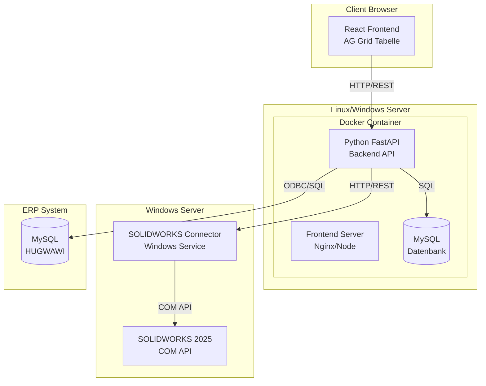

# Umsetzungsplan: Webbasiertes Stücklisten-ERP System

## Architektur-Übersicht

Das System besteht aus vier Hauptkomponenten:



## Projektstruktur

```
00200_HG_SW_Stuecklisten_ERP/
├── backend/
│   ├── app/
│   │   ├── __init__.py
│   │   ├── main.py                 # FastAPI App
│   │   ├── models/                 # SQLAlchemy Models
│   │   │   ├── __init__.py
│   │   │   ├── project.py
│   │   │   ├── article.py
│   │   │   ├── document.py
│   │   │   └── order.py
│   │   ├── schemas/                # Pydantic Schemas
│   │   │   ├── __init__.py
│   │   │   ├── project.py
│   │   │   └── article.py
│   │   ├── api/
│   │   │   ├── __init__.py
│   │   │   ├── routes/
│   │   │   │   ├── __init__.py
│   │   │   │   ├── projects.py
│   │   │   │   ├── articles.py
│   │   │   │   ├── documents.py
│   │   │   │   └── erp.py
│   │   ├── services/
│   │   │   ├── __init__.py
│   │   │   ├── solidworks_service.py
│   │   │   ├── erp_service.py
│   │   │   └── document_service.py
│   │   └── core/
│   │       ├── __init__.py
│   │       ├── config.py
│   │       └── database.py
│   ├── alembic/                    # DB Migrations
│   ├── requirements.txt
│   ├── Dockerfile
│   └── .env.example
│
├── frontend/
│   ├── src/
│   │   ├── components/
│   │   │   ├── ProjectHeader.tsx
│   │   │   ├── ArticleGrid.tsx     # AG Grid Hauptkomponente
│   │   │   ├── ArticleRow.tsx
│   │   │   └── DocumentStatus.tsx
│   │   ├── services/
│   │   │   ├── api.ts
│   │   │   └── types.ts
│   │   ├── hooks/
│   │   │   └── useArticles.ts
│   │   ├── App.tsx
│   │   └── main.tsx
│   ├── package.json
│   ├── Dockerfile
│   └── vite.config.ts
│
├── solidworks-connector/
│   ├── src/
│   │   ├── SolidWorksConnector.py
│   │   ├── PropertyReader.py
│   │   ├── DocumentGenerator.py
│   │   └── service.py              # Windows Service Wrapper
│   ├── requirements.txt
│   └── setup.py
│
├── docker-compose.yml
├── .env.example
└── README.md
```

## Datenmodell (MySQL)

### Haupttabellen

**projects**

- id (PK)
- au_nr (AU-NR)
- project_path
- created_at, updated_at

**articles** (Haupttabelle für Stücklistenzeilen)

- id (PK)
- project_id (FK)
- pos_nr
- hg_artikelnummer
- benennung
- konfiguration
- teilenummer
- menge
- abteilung_lieferant
- werkstoff
- werkstoff_nr
- oberflaeche
- oberflaechenschutz
- farbe
- lieferzeit
- laenge, breite, hoehe, gewicht
- pfad
- sldasm_sldprt_pfad
- slddrw_pfad
- in_stueckliste_anzeigen (Boolean)
- teiletyp_fertigungsplan

**orders** (Bestellinformationen)

- id (PK)
- article_id (FK)
- hg_bnr
- bnr_status (Unbearbeitet/Bestellt/Geliefert/Erledigt)
- bnr_menge
- bestellkommentar
- hg_lt
- bestaetigter_lt

**documents** (Dokumentstatus)

- id (PK)
- article_id (FK)
- document_type (PDF, Bestell_PDF, DXF, Bestell_DXF, SW_Part_ASM, SW_DRW, STEP, X_T, STL, ESP)
- file_path
- exists (Boolean)
- generated_at

**document_generation_flags** (Druck-/Generierungsflags)

- id (PK)
- article_id (FK)
- pdf_drucken (Boolean)
- pdf_bestell_pdf (Boolean)
- dxf (Boolean)
- bestell_dxf (Boolean)
- step (Boolean)
- x_t (Boolean)
- stl (Boolean)

## API-Endpunkte

### Projekte

- `GET /api/projects` - Liste aller Projekte
- `GET /api/projects/{id}` - Projektdetails
- `POST /api/projects` - Neues Projekt erstellen
- `POST /api/projects/{id}/import-solidworks` - SOLIDWORKS-Daten importieren

### Artikel/Stückliste

- `GET /api/projects/{id}/articles` - Alle Artikel eines Projekts
- `GET /api/articles/{id}` - Einzelner Artikel
- `PATCH /api/articles/{id}` - Artikel aktualisieren
- `POST /api/articles` - Neuen Artikel erstellen
- `DELETE /api/articles/{id}` - Artikel löschen
- `POST /api/articles/batch-update` - Batch-Update mehrerer Artikel

### ERP-Integration

- `POST /api/articles/{id}/check-erp` - Artikelnummer im ERP prüfen (Einzelprüfung)
- `POST /api/projects/{id}/check-all-articlenumbers` - Batch-Prüfung: Durchläuft alle Artikel, prüft Artikelnummern in ERP (entspricht VBA `Check_Articlenumber_Exists`)
        - Response: `{ "checked": [...], "exists": [...], "not_exists": [...] }`
        - Logik: Prüft für jede Zeile Spalte C2 (H+G Artikelnummer) in MySQL-Datenbank, setzt Status (grün=vorhanden, rot=fehlt)
- `GET /api/articles/{id}/orders` - Bestellungen abrufen
- `POST /api/projects/{id}/sync-orders` - Bestellungen synchronisieren

### Dokumente

- `GET /api/articles/{id}/documents` - Dokumentstatus abrufen
- `POST /api/articles/{id}/check-documents` - Dokumente prüfen (Dateisystem-Check)
- `POST /api/articles/{id}/generate-documents` - Einzelnes Dokument generieren (für spezifischen Dokumenttyp)
- `POST /api/projects/{id}/generate-documents-batch` - Batch-Generierung: Durchläuft alle Artikel, generiert Dokumente wo Wert="1"
        - Request Body: `{ "document_types": ["PDF", "Bestell_PDF", "DXF", "Bestell_DXF", "STEP", "X_T", "STL"] }` (optional, wenn leer: alle Typen)
        - Response: `{ "generated": [...], "failed": [...], "skipped": [...] }`
        - Logik: Prüft für jede Zeile alle Dokument-Spalten (B2, B3, B4, B5, B8, B9, B10), wenn Wert="1" wird Dokument generiert, nach Erfolg wird Wert auf "x" gesetzt
- `POST /api/projects/{id}/batch-print-pdf` - Batch-PDF-Druck: Durchläuft alle Artikel, druckt PDFs wo B1="1" UND B2="x"
        - Request Body: `{ "confirm_printer_setup": true }` (optional, Frontend zeigt Bestätigungsdialog)
        - Response: `{ "printed": [...], "failed": [...], "skipped": [...] }`
        - Logik:
                - Prüft für jede Zeile: B1 (PDF Drucken) = "1" UND B2 (PDF) = "x"
                - Liest PDF-Hyperlink aus B2
                - Baut vollständigen Dateipfad: `pfad` + Dateiname aus Hyperlink
                - Sendet Druckauftrag an System-Drucker
                - Setzt nach erfolgreichem Druck: B1 = "x" (als "gedruckt" markiert)

### SOLIDWORKS-Connector

- `POST /api/solidworks/read-properties` - Custom Properties lesen
- `POST /api/solidworks/write-properties` - Custom Properties schreiben
- `POST /api/solidworks/generate-documents` - PDF/DXF generieren
- `POST /api/solidworks/get-all-parts-from-assembly` - Liest alle Teile und Properties aus Assembly (entspricht `Main_Get_All_Parts_and_Properties_From_Assembly`)
        - Request Body: `{ "assembly_filepath": "C:/Pfad/zur/Assembly.SLDASM" }`
        - Response: 2D-Array mit Struktur:
                - `Results[0][j]` = Child/Position (0, 1, 2, ...)
                - `Results[1][j]` = Partname
                - `Results[2][j]` = Configuration
                - `Results[4][i]` = Property Name (für Properties-Schleife)
                - `Results[5][i]` = Property Value
                - `Results[7][j]` = X-Dimension (Länge)
                - `Results[8][j]` = Y-Dimension (Breite)
                - `Results[9][j]` = Z-Dimension (Höhe)
                - `Results[10][j]` = Gewicht
                - `Results[11][j]` = Filepath Part/ASM
                - `Results[12][j]` = Filepath Drawing
                - `Results[13][j]` = Exclude from Boom Flag (1 = ausgeschlossen)

## Frontend-Features (React + AG Grid)

### Tabellenstruktur und Layout

Die Haupttabelle ist sehr breit (ca. 40+ Spalten) und erfordert horizontales Scrolling. AG Grid wird mit folgenden Layout-Einstellungen konfiguriert:

- **Container**: Volle Bildschirmbreite und -höhe (100vw / 100vh)
- **Horizontaler Scrollbalken**: Aktiviert, sichtbar bei Bedarf
- **Pinned Columns**: Erste 2-3 Spalten (z.B. Pos-Nr, H+G Artikelnummer) können fixiert werden
- **Column Groups**: Drei Hauptgruppen (Block A, B, C) mit Untergruppen
- **Column Sizing**:
        - Auto-Size für optimale Lesbarkeit
        - Minimale Spaltenbreiten je nach Inhalt
        - Resizable Spalten (Benutzer kann anpassen)

### Detaillierte Spaltenstruktur

#### Block A: Bestell-/Auftragsinformationen (Spalten 1-6)

| Spalte | Feldname | Breite | Typ | Editierbar | Beschreibung |

|--------|----------|--------|-----|------------|--------------|

| A1 | HG-BNR | 120px | Text | ❌ Read-Only | Bestellnummer |

| A2 | BNR-Status | 100px | Status | ❌ Read-Only | Status-Badge (Unbearbeitet/Bestellt/Geliefert/Erledigt) mit Farbcodierung |

| A3 | BNR-Menge | 90px | Zahl | ❌ Read-Only | Bestellmenge |

| A4 | Bestellkommentar | 200px | Text | ❌ Read-Only | Kommentar zur Bestellung |

| A5 | HG-LT | 100px | Datum | ❌ Read-Only | Liefertermin |

| A6 | Bestätigter LT | 120px | Datum | ❌ Read-Only | Bestätigter Liefertermin |

**Spaltengruppe A**: "Bestellinformationen" (gedrehte Überschrift optional)

#### Block B: Dokumentstatus (Spalten 7-17, 11 Spalten)

**Wichtige Logik**: Die Spalten B2, B3, B4, B5, B8, B9, B10 kombinieren Status-Anzeige und Generierungs-Flag (Excel-kompatibel):

- **Leer** = Dokument existiert nicht → Zelle rot hinterlegt, kein Hyperlink
- **"x"** = Dokument existiert → Zelle grün hinterlegt, Hyperlink zur Datei aktiv
- **"1"** = Dokument soll generiert werden → Zelle gelb/orange markiert, wird bei Button-Klick generiert

| Spalte | Feldname | Breite | Typ | Editierbar | Beschreibung |

|--------|----------|--------|-----|------------|--------------|

| B1 | PDF Drucken | 80px | Status/Input | ✅ (leer/1/x) | PDF-Druck-Flag: leer=nicht drucken, 1=zum Drucken markiert, x=gedruckt |

| B2 | PDF | 100px | Status/Input | ✅ (leer/1/x) | PDF-Status: leer=fehlt (rot), x=vorhanden (grün+Link), 1=generieren (gelb) |

| B3 | Bestell_PDF | 100px | Status/Input | ✅ (leer/1/x) | Bestellversion PDF: leer=fehlt, x=vorhanden, 1=generieren |

| B4 | DXF | 100px | Status/Input | ✅ (leer/1/x) | DXF-Datei: leer=fehlt, x=vorhanden, 1=generieren |

| B5 | Bestell_DXF | 100px | Status/Input | ✅ (leer/1/x) | Bestellversion DXF: leer=fehlt, x=vorhanden, 1=generieren |

| B6 | SW_Part_ASM | 100px | Link/Status | ❌ Read-Only | SOLIDWORKS Part/Assembly vorhanden (nur Status, nicht generierbar) |

| B7 | SW_DRW | 100px | Link/Status | ❌ Read-Only | SOLIDWORKS Drawing vorhanden (nur Status, nicht generierbar) |

| B8 | STEP | 100px | Status/Input | ✅ (leer/1/x) | STEP-Datei: leer=fehlt, x=vorhanden, 1=generieren |

| B9 | X_T | 100px | Status/Input | ✅ (leer/1/x) | X_T-Datei: leer=fehlt, x=vorhanden, 1=generieren |

| B10 | STL | 100px | Status/Input | ✅ (leer/1/x) | STL-Datei: leer=fehlt, x=vorhanden, 1=generieren |

| B11 | ESP | 100px | Status | ❌ Read-Only | ESP-Status (nur Anzeige) |

| B12 | BN-AB | 100px | Status/Input | ✅ (leer/x) | AB-Status (nur Anzeige, manuell Änderbar) |

**Spaltengruppe B**: "Dokumentstatus" (gedrehte Überschrift, wie in Excel)

**Header-Konfiguration für Block B**:

- Alle Spalten-Überschriften in Block B werden um 90° gedreht angezeigt
- Header-Höhe für Block B: **120px** (statt Standard 50px), damit der Text vollständig lesbar ist
- CSS-Transformation: `transform: rotate(-90deg)` oder AG Grid `headerClass` mit entsprechender CSS-Klasse
- Textausrichtung: Zentriert nach Rotation

**Dokumentgenerierungs-Workflow**:

1. Benutzer trägt "1" in die gewünschten Dokument-Spalten ein (B2, B3, B4, B5, B8, B9, B10)
2. Benutzer klickt auf Button "Dokumente erstellen" in der Toolbar
3. System durchläuft alle Zeilen der Tabelle (auch gefilterte, wenn Filter aktiv)
4. Für jede Zeile: Prüfe alle Dokument-Spalten (B2, B3, B4, B5, B8, B9, B10)
5. Wenn Wert = "1":

            - Generiere entsprechendes Dokument über SOLIDWORKS-Connector
            - Dokumenttyp wird aus Spaltenname abgeleitet (PDF, Bestell_PDF, DXF, Bestell_DXF, STEP, X_T, STL)

6. Nach erfolgreicher Generierung:

            - Setze Wert auf "x"
            - Aktualisiere Status-Anzeige (grün + Hyperlink)
            - Speichere Dateipfad in Datenbank

7. Bei Fehler:

            - Setze Wert zurück auf leer
            - Zeige Fehlermeldung in Status-Bar oder als Toast-Notification
            - Zelle bleibt rot markiert

**PDF-Druck-Workflow** (entspricht VBA `Main_Print_PDF`):

1. Benutzer markiert Zeilen zum Drucken: B1 (PDF Drucken) = "1"
2. Voraussetzung: B2 (PDF) muss = "x" sein (PDF muss existieren)
3. Benutzer klickt auf Button "PDF Drucken" in der Toolbar
4. **Bestätigungsdialog** wird angezeigt:
   ```
   "Bitte vor der Verwendung eine PDF öffnen und den passenden Drucker 
   und Druckeinstellungen wählen und Datei Drucken. 
   Ist der Drucker korrekt gewählt? Falls Nein dies tun und die Funktion erneut ausführen"
   ```

5. Wenn Benutzer bestätigt:

            - System durchläuft alle Zeilen der Tabelle (auch gefilterte, wenn Filter aktiv)
            - Für jede Zeile prüfen:
                    - **Bedingung**: B1 = "1" UND B2 = "x"
            - Wenn Bedingung erfüllt:
                    - Lese PDF-Hyperlink aus B2 (Zelle enthält Hyperlink zur PDF-Datei)
                    - Extrahiere Dateiname aus Hyperlink (alles nach dem letzten "/")
                    - Baue vollständigen Dateipfad: `pfad` (aus Spalte C19) + Dateiname
                    - Prüfe ob Dateipfad existiert
                    - Wenn Datei existiert:
                            - Sende Druckauftrag an System-Standarddrucker (über Backend/System-API)
                            - Nach erfolgreichem Druck: Setze B1 = "x" (als "gedruckt" markiert)
                            - Speichere Änderung in Datenbank
                    - Bei Fehler: Zeige Fehlermeldung, B1 bleibt "1"

6. Status-Bar zeigt Ergebnis: Anzahl gedruckter, fehlgeschlagener und übersprungener PDFs

#### Block C: Stücklisten-/Artikelinformationen (Spalten 17-40+)

| Spalte | Feldname | Breite | Typ | Editierbar | Beschreibung |

|--------|----------|--------|-----|------------|--------------|

| C1 | Pos-Nr | 80px | Zahl | ❌ Read-Only | Positionsnummer |

| C2 | H+G Artikelnummer | 150px | Text | ❌ Read-Only | Artikelnummer (mit ERP-Abgleich-Farbe: grün=vorhanden, rot=fehlt) |

| C3 | BENENNUNG | 200px | Text | ❌ Read-Only | Artikelbezeichnung |

| C4 | Konfiguration | 150px | Text | ❌ Read-Only | SOLIDWORKS-Konfiguration |

| C5 | Teilenummer | 120px | Text | ❌ Read-Only | Teilenummer |

| C6 | Menge | 80px | Zahl | ❌ Read-Only | Stückzahl |

| C7 | Teiletyp/Fertigungsplan | 180px | Text | ✅ (max 150 Zeichen) | Editierbar |

| C8 | Abteilung / Lieferant | 150px | Text | ✅ (max 150 Zeichen) | Editierbar |

| C9 | Werkstoff | 120px | Text | ✅ (max 150 Zeichen) | Editierbar |

| C10 | Werkstoff-Nr. | 120px | Text | ✅ (max 150 Zeichen) | Editierbar |

| C11 | Oberfläche | 120px | Text | ✅ (max 150 Zeichen) | Editierbar |

| C12 | Oberflächenschutz | 150px | Text | ✅ (max 150 Zeichen) | Editierbar |

| C13 | Farbe | 100px | Text | ✅ (max 150 Zeichen) | Editierbar |

| C14 | Lieferzeit | 100px | Text | ✅ (max 150 Zeichen) | Editierbar |

| C15 | Länge | 100px | Zahl | ✅ (max 150 Zeichen) | Editierbar |

| C16 | Breite | 100px | Zahl | ✅ (max 150 Zeichen) | Editierbar |

| C17 | Höhe | 100px | Zahl | ✅ (max 150 Zeichen) | Editierbar |

| C18 | Gewicht | 100px | Zahl | ✅ (max 150 Zeichen) | Editierbar |

| C19 | Pfad | 300px | Text/Link | ❌ Read-Only | Dateipfad (Hyperlink) |

| C20 | SLDASM/SLDPRT Pfad | 300px | Text/Link | ❌ Read-Only | SOLIDWORKS Part/Assembly Pfad |

| C21 | SLDDRW Pfad | 300px | Text/Link | ❌ Read-Only | SOLIDWORKS Drawing Pfad |

| C22 | In Stückliste anzeigen | 120px | Checkbox | ✅ (1 = anzeigen) | Filter-Flag |

**Spaltengruppe C**: "Stücklisteninformationen"

### Gesamtbreite und Scrolling

- **Geschätzte Gesamtbreite**: ~4000-5000px (abhängig von Inhalt)
- **Viewport-Breite**: 100% des Browserfensters
- **Horizontaler Scrollbalken**:
        - Immer sichtbar wenn Tabelle breiter als Viewport
        - Smooth Scrolling aktiviert
        - Scroll-Position wird gespeichert (Session/LocalStorage)
- **Vertikaler Scrollbalken**:
        - Für Zeilen-Scrolling
        - Virtual Scrolling für Performance (AG Grid Standard)

### AG Grid Konfiguration

```typescript
// Beispiel-Konfiguration für ArticleGrid.tsx
const gridOptions = {
  // Layout
  domLayout: 'normal',
  suppressHorizontalScroll: false,
  alwaysShowHorizontalScroll: true,
  
  // Column Groups
  columnGroups: [
    { headerName: 'Bestellinformationen', children: [/* Block A Spalten */] },
    { headerName: 'Dokumentstatus', children: [/* Block B Spalten */] },
    { headerName: 'Stücklisteninformationen', children: [/* Block C Spalten */] }
  ],
  
  // Pinned Columns (optional)
  pinnedLeftColumns: ['pos_nr', 'hg_artikelnummer'],
  
  // Features
  enableRangeSelection: true,
  enableClipboard: true,
  enableCellTextSelection: true,
  suppressRowClickSelection: false,
  
  // Styling
  rowHeight: 35,
  headerHeight: 120, // Erhöht für 90° gedrehte Überschriften in Block B
  defaultColDef: {
    resizable: true,
    sortable: true,
    filter: true,
    minWidth: 80
  },
  
  // Spezielle Konfiguration für Block B Spalten (gedrehte Überschriften)
  columnDefs: [
    // ... Block A Spalten ...
    // Block B Spalten mit gedrehten Überschriften
    {
      headerName: 'PDF',
      field: 'pdf',
      width: 100,
      headerClass: 'rotated-header', // CSS-Klasse für 90° Rotation
      cellRenderer: 'documentStatusRenderer' // Custom Renderer für leer/1/x
    },
    // ... weitere Block B Spalten mit headerClass: 'rotated-header' ...
    // ... Block C Spalten ...
  ]
}

// CSS für gedrehte Überschriften (in ArticleGrid.module.css oder global)
// .rotated-header {
//   writing-mode: vertical-rl;
//   text-orientation: mixed;
//   height: 120px;
//   display: flex;
//   align-items: center;
//   justify-content: center;
//   white-space: nowrap;
// }
// Alternative mit transform (falls writing-mode nicht ausreicht):
// .rotated-header .ag-header-cell-label {
//   transform: rotate(-90deg);
//   transform-origin: center;
//   width: 120px;
//   height: 100px;
//   display: flex;
//   align-items: center;
//   justify-content: center;
// }
```

### Cell Renderers und Styling

- **Status-Spalten (BNR-Status)**: Badge-Component mit Farbcodierung
        - Unbearbeitet: grau
        - Bestellt: gelb
        - Geliefert: grün
        - Erledigt: blau

- **Dokument-Spalten (B2, B3, B4, B5, B8, B9, B10)**: Kombinierter Status/Input-Renderer
        - **Leer**: Rote Zelle, rotes X-Icon, kein Hyperlink → Dokument fehlt
        - **"x"**: Grüne Zelle, grüner Checkmark + Hyperlink → Dokument vorhanden, Klick öffnet Datei/Ordner
        - **"1"**: Gelbe/orange Zelle, gelbes Warn-Icon → Dokument soll generiert werden (wird bei Button-Klick erstellt)
        - Inline-Editing: Benutzer kann "1", "x" oder leer eingeben
        - Validierung: Nur leer, "1" oder "x" erlaubt

- **PDF-Druck-Spalte (B1)**: Status/Input-Renderer
        - **Leer**: Graue Zelle → Nicht zum Drucken markiert
        - **"1"**: Gelbe/orange Zelle → Zum Drucken markiert (wird gedruckt wenn B2="x")
        - **"x"**: Grüne Zelle → Bereits gedruckt
        - Inline-Editing: Benutzer kann "1", "x" oder leer eingeben

- **Artikelnummer (H+G Artikelnummer)** - Spalte C2:
        - Hintergrundfarbe basierend auf ERP-Abgleich (wird durch Button "ERP-Abgleich" aktualisiert)
        - **Grün** (#90EE90): Artikel existiert im ERP (entspricht Excel-Style "Gut")
        - **Rot** (#FFB6C1): Artikel fehlt im ERP (entspricht Excel-Style "Schlecht")
        - Status wird durch `POST /api/projects/{id}/check-all-articlenumbers` aktualisiert

- **Editierbare Textfelder**:
        - Inline-Editing aktiviert
        - Max-Length Validierung (150 Zeichen)
        - Visuelles Feedback bei Änderungen

- **Checkbox-Spalten**:
        - AG Grid Checkbox-Editor
        - Wert: 1 = aktiv, 0 = inaktiv

### UI-Komponenten

- **Projekt-Header**: Fixiert oberhalb der Tabelle
        - AU-NR: `AU-2024-00571`
        - Projektpfad: Hyperlink
        - **Toolbar**:
                - Import SOLIDWORKS
                - **ERP-Abgleich** (prüft alle Artikelnummern in Spalte C2 gegen ERP-Datenbank)
                - Sync ERP (Bestellungen synchronisieren)
                - **Dokumente erstellen** (Hauptbutton: durchläuft alle Zeilen, generiert Dokumente wo Wert="1")
                - Dokumente prüfen (Dateisystem-Check)
                - PDF Drucken (Batch-Druck für markierte Zeilen)
                - Export (Excel, CSV)

- **Haupttabelle (AG Grid)**:
        - Volle Breite und Höhe
        - Horizontaler + vertikaler Scrollbalken
        - Row Selection (Einzel- und Mehrfachauswahl)

- **Status-Bar**: Unterhalb der Tabelle
        - Anzahl Zeilen
        - Gefilterte Zeilen
        - Letzte Aktualisierung

- **Kontext-Menü**: Rechtsklick auf Zeile
        - Dokumente prüfen
        - Dokumente generieren
        - ERP-Abgleich (Einzelprüfung)
        - Zeile löschen
        - In SOLIDWORKS öffnen

## SOLIDWORKS-Connector (Windows Service)

### Funktionalität

- **PropertyReader**: Liest Custom Properties aus SOLIDWORKS-Assembly/Part
- **PropertyWriter**: Schreibt Custom Properties zurück
- **DocumentGenerator**: Erzeugt PDF, DXF, STEP, X_T, STL
- **TreeTraverser**: Traversiert Teilebaum, filtert versteckte Komponenten
- **AssemblyReader**: Liest alle Teile und Properties aus Assembly (entspricht VBA `Main_Get_All_Parts_and_Properties_From_Assembly`)

### Kommunikation

- REST API (FastAPI) auf Windows-Server
- Empfängt Requests vom Backend
- Nutzt SOLIDWORKS COM API
- Gibt Ergebnisse zurück

### 3D-Dokument-Generierung (STEP, X_T, STL)

**Funktion**: `create_3d_documents()` (entspricht VBA `Create_3D_Documents`)

```python
def create_3d_documents(
    sw_filepath_with_documentname: str,
    step: bool = False,
    x_t: bool = False,
    stl: bool = False
) -> bool:
    """
    Erstellt 3D-Dokumente (STEP, X_T, STL) aus SOLIDWORKS-Datei
    
    Entspricht VBA Create_3D_Documents()
    
    Args:
        sw_filepath_with_documentname: Vollständiger Pfad zur SOLIDWORKS-Datei (.SLDPRT oder .SLDASM)
        step: True wenn STEP-Datei erstellt werden soll
        x_t: True wenn X_T-Datei erstellt werden soll
        stl: True wenn STL-Datei erstellt werden soll
    
    Returns:
        True wenn erfolgreich, False bei Fehler
    """
    import win32com.client
    import os
    
    try:
        # Prüfe ob Datei .SLDPRT oder .SLDASM ist
        if not (sw_filepath_with_documentname.endswith(".SLDPRT") or 
                sw_filepath_with_documentname.endswith(".SLDASM")):
            return False
        
        # Erstelle Pfadname ohne Endung
        s_pathname = sw_filepath_with_documentname[:-7]  # Entferne ".SLDPRT" oder ".SLDASM"
        
        # Öffne SOLIDWORKS-Dokument
        sw_app = win32com.client.Dispatch("SldWorks.Application")
        sw_app.Visible = False
        
        # Bestimme Dokumenttyp
        doc_type = 1 if sw_filepath_with_documentname.endswith(".SLDPRT") else 3  # swDocPART oder swDocASSEMBLY
        
        # Öffne Dokument
        sw_part = sw_app.OpenDoc6(
            sw_filepath_with_documentname,
            doc_type,
            0,  # swOpenDocOptions_Silent
            "",
            0,
            0
        )
        
        if not sw_part:
            return False
        
        # Aktiviere Dokument
        sw_app.ActivateDoc(sw_filepath_with_documentname)
        
        # STEP-Datei erstellen
        if step:
            # Setze STEP-Export-Optionen (AP214)
            sw_app.SetUserPreferenceIntegerValue(214, 214)  # swStepAP = 214
            # Speichere als STEP
            sw_part.SaveAs2(f"{s_pathname}.stp", 0, True, False)
        
        # X_T-Datei erstellen
        if x_t:
            # Speichere als X_T
            sw_part.SaveAs2(f"{s_pathname}.x_t", 0, True, False)
        
        # STL-Datei erstellen
        if stl:
            # Speichere als STL
            sw_part.SaveAs2(f"{s_pathname}.stl", 0, True, False)
        
        # Schließe Dokument
        sw_app.CloseDoc(sw_filepath_with_documentname)
        
        return True
        
    except Exception as e:
        # Bei Fehler: False zurückgeben
        return False
```

**API-Endpunkt**:

- `POST /api/solidworks/create-3d-documents` - Erstellt 3D-Dokumente (STEP, X_T, STL)
        - Request Body: `{ "filepath": "C:/Pfad/zu/Datei.SLDPRT", "step": true, "x_t": true, "stl": true }`
        - Response: `{ "success": true, "created_files": ["file.stp", "file.x_t", "file.stl"] }`

## Backend-Implementierung: SOLIDWORKS-Import

### Workflow (entspricht VBA `Main_Create_Projektsheet`)

1. **Prüfung**: Assembly-Filepath muss vorhanden sein
2. **Datenabfrage**: Aufruf SOLIDWORKS-Connector `get-all-parts-from-assembly`
3. **Datenverarbeitung**: Mapping der SOLIDWORKS-Daten zu Artikel-Struktur
4. **Aggregation**: Gruppierung nach Name + Konfiguration, Summierung der Mengen
5. **Speicherung**: Artikel in Datenbank speichern

### Custom Properties Mapping

Die folgenden SOLIDWORKS Custom Properties werden zu Datenbankfeldern gemappt:

| SOLIDWORKS Property Name | Datenbank-Feld | Spalte | Beschreibung |

|--------------------------|----------------|--------|--------------|

| H+G Artikelnummer | hg_artikelnummer | C2 | Artikelnummer |

| Teilenummer | teilenummer | C5 | Teilenummer |

| Material | werkstoff | C9 | Werkstoff |

| HUGWAWI - Abteilung | abteilung_lieferant | C8 | Abteilung/Lieferant |

| Werkstoffgruppe | werkstoff_nr | C10 | Werkstoff-Nr. |

| Oberfläche_ZSB / Oberfläche | oberflaeche | C11 | Oberfläche |

| Oberflächenschutz | oberflaechenschutz | C12 | Oberflächenschutz |

| Farbe | farbe | C13 | Farbe |

| Lieferzeit / Lieferzeit - geschätzt | lieferzeit | C14 | Lieferzeit |

**Hinweis**: Die Menge wird durch Aggregation (Gruppierung nach Name + Konfiguration) ermittelt.

### Service-Layer: `solidworks_service.py`

```python
async def import_solidworks_assembly(project_id: int, assembly_filepath: str) -> dict:
    """
    Importiert SOLIDWORKS-Assembly entsprechend VBA Main_Create_Projektsheet()
    
    Workflow:
    1. Ruft SOLIDWORKS-Connector auf: get-all-parts-from-assembly
    2. Verarbeitet Ergebnis-Array (entspricht Main_GET_ALL_FROM_SW)
    3. Aggregiert Teile nach Name + Konfiguration (entspricht Main_SW_Import_To_Projectsheet)
    4. Speichert Artikel in Datenbank
    """
    # 1. SOLIDWORKS-Connector aufrufen
    connector_response = await call_solidworks_connector(
        "get-all-parts-from-assembly",
        {"assembly_filepath": assembly_filepath}
    )
    
    results = connector_response["results"]  # 2D-Array
    
    # 2. Verarbeitung (entspricht Main_GET_ALL_FROM_SW)
    articles_data = []
    child = 0
    begin_properties = 0
    end_properties = 0
    
    for j in range(len(results[0])):
        if results[0][j] != child:
            # Neues Teil gefunden - vorheriges Teil abschließen
            if j > 0:
                article = {
                    "pos_nr": results[0][j-1] if results[0][j-1] else "-",
                    "partname": results[1][j-1] if results[1][j-1] else "-",
                    "konfiguration": results[2][j-1] if results[2][j-1] else "-",
                    "laenge": str(results[7][j-1]) if results[7][j-1] else "-",
                    "breite": str(results[8][j-1]) if results[8][j-1] else "-",
                    "hoehe": str(results[9][j-1]) if results[9][j-1] else "-",
                    "gewicht": str(results[10][j-1]) if results[10][j-1] else "-",
                    "pfad": results[11][j-1].rsplit("\\", 1)[0] if results[11][j-1] else "-",
                    "sldasm_sldprt_pfad": results[11][j-1] if results[11][j-1] else "-",
                    "slddrw_pfad": results[12][j-1] if results[12][j-1] else "-",
                    "in_stueckliste_anzeigen": not bool(results[13][j-1])  # 1 = ausgeschlossen
                }
                
                # Custom Properties verarbeiten (Schleife von begin_properties bis end_properties)
                for i in range(begin_properties, end_properties):
                    prop_name = results[4][i]
                    prop_value = results[5][i] if results[5][i] else "-"
                    
                    # Mapping Custom Properties zu Spalten
                    if prop_name == "H+G Artikelnummer":
                        article["hg_artikelnummer"] = prop_value
                    elif prop_name == "Teilenummer":
                        article["teilenummer"] = prop_value
                    elif prop_name == "Material":
                        article["werkstoff"] = prop_value
                    elif prop_name == "HUGWAWI - Abteilung":
                        article["abteilung_lieferant"] = prop_value
                    elif prop_name == "Werkstoffgruppe":
                        article["werkstoff_nr"] = prop_value
                    elif prop_name in ["Oberfläche_ZSB", "Oberfläche"]:
                        article["oberflaeche"] = prop_value
                    elif prop_name == "Oberflächenschutz":
                        article["oberflaechenschutz"] = prop_value
                    elif prop_name == "Farbe":
                        article["farbe"] = prop_value
                    elif prop_name in ["Lieferzeit", "Lieferzeit - geschätzt"]:
                        article["lieferzeit"] = prop_value
                
                articles_data.append(article)
            
            begin_properties = end_properties
            end_properties = j
            child += 1
    
    # 3. Aggregation (entspricht Main_SW_Import_To_Projectsheet)
    # Gruppiere nach Name + Konfiguration und summiere Mengen
    aggregated_articles = {}
    
    for article in articles_data:
        key = f"{article['partname']} {article['konfiguration']}"
        
        if key not in aggregated_articles:
            aggregated_articles[key] = article.copy()
            aggregated_articles[key]["menge"] = 1
        else:
            aggregated_articles[key]["menge"] += 1
    
    # 4. Speicherung in Datenbank
    created_articles = []
    for article_data in aggregated_articles.values():
        article = Article(
            project_id=project_id,
            **article_data
        )
        db.add(article)
        created_articles.append(article)
    
    db.commit()
    
    return {
        "success": True,
        "imported_count": len(created_articles),
        "total_parts_count": len(articles_data),
        "aggregated_count": len(aggregated_articles)
    }
```

### API-Route: `routes/projects.py`

```python
@router.post("/projects/{project_id}/import-solidworks")
async def import_solidworks(
    project_id: int,
    assembly_filepath: str,
    db: Session = Depends(get_db)
):
    """
    Importiert SOLIDWORKS-Assembly in Projekt
    
    Entspricht VBA Main_Create_Projektsheet()
    """
    # Prüfe ob Projekt existiert
    project = db.query(Project).filter(Project.id == project_id).first()
    if not project:
        raise HTTPException(status_code=404, detail="Projekt nicht gefunden")
    
    # Prüfe ob Assembly-Filepath vorhanden
    if not assembly_filepath or not os.path.exists(assembly_filepath):
        raise HTTPException(
            status_code=400,
            detail="Assembly-Filepath fehlt oder Datei existiert nicht"
        )
    
    result = await solidworks_service.import_solidworks_assembly(
        project_id,
        assembly_filepath
    )
    
    return result
```

### SOLIDWORKS-Connector: `AssemblyReader.py`

```python
def get_all_parts_and_properties_from_assembly(assembly_filepath: str) -> list:
    """
    Liest alle Teile und Properties aus SOLIDWORKS-Assembly
    
    Entspricht VBA Main_Get_All_Parts_and_Properties_From_Assembly()
    
    Returns:
        2D-Array mit Struktur:
        - results[0][j] = Child/Position
        - results[1][j] = Partname
        - results[2][j] = Configuration
        - results[4][i] = Property Name
        - results[5][i] = Property Value
        - results[7][j] = X-Dimension
        - results[8][j] = Y-Dimension
        - results[9][j] = Z-Dimension
        - results[10][j] = Gewicht
        - results[11][j] = Filepath Part/ASM
        - results[12][j] = Filepath Drawing
        - results[13][j] = Exclude from Boom Flag
    """
    import win32com.client
    
    sw_app = win32com.client.Dispatch("SldWorks.Application")
    sw_app.Visible = False
    
    # Öffne Assembly
    sw_model = sw_app.OpenDoc6(
        assembly_filepath,
        3,  # swDocASSEMBLY
        0,  # swOpenDocOptions_Silent
        "",
        0,
        0
    )
    
    if not sw_model:
        raise Exception(f"Konnte Assembly nicht öffnen: {assembly_filepath}")
    
    results = []
    child = 0
    
    # Traversiere Teilebaum
    components = sw_model.GetComponents(True)  # True = alle Ebenen
    
    for component in components:
        # Prüfe ob Teil versteckt ist (sollte ausgeschlossen werden)
        is_hidden = component.IsSuppressed() or component.IsEnvelope()
        
        if not is_hidden:
            # Lese Part/Assembly
            part_path = component.GetPathName()
            part_name = component.Name2
            config_name = component.ReferencedConfiguration
            
            # Öffne Part für Dimensions-Abfrage
            part_model = sw_app.OpenDoc6(
                part_path,
                1 if part_path.endswith(".SLDPRT") else 3,
                0,
                "",
                0,
                0
            )
            
            if part_model:
                # Lese Dimensionen
                box = part_model.GetPartBox(True)  # True = aktueller Zustand
                x_dim = box[3] - box[0] if box else 0
                y_dim = box[4] - box[1] if box else 0
                z_dim = box[5] - box[2] if box else 0
                
                # Lese Gewicht
                mass_props = part_model.GetMassProperties2(0)
                weight = mass_props[0] if mass_props else 0
                
                # Lese Drawing-Pfad
                drawing_path = ""
                # TODO: Drawing-Pfad ermitteln (falls vorhanden)
                
                # Lese Custom Properties
                properties = []
                custom_props = part_model.Extension.CustomPropertyManager(config_name)
                prop_names = custom_props.GetNames()
                
                for prop_name in prop_names:
                    prop_value = custom_props.Get6(prop_name, False, "")[1]
                    properties.append({
                        "name": prop_name,
                        "value": prop_value
                    })
                
                # Füge Teil-Info hinzu
                results.append([
                    child,  # [0] Position
                    part_name,  # [1] Partname
                    config_name,  # [2] Configuration
                    None,  # [3] Reserved
                    None,  # [4] Property Name (wird in Schleife gefüllt)
                    None,  # [5] Property Value (wird in Schleife gefüllt)
                    None,  # [6] Reserved
                    x_dim,  # [7] X-Dimension
                    y_dim,  # [8] Y-Dimension
                    z_dim,  # [9] Z-Dimension
                    weight,  # [10] Gewicht
                    part_path,  # [11] Filepath Part/ASM
                    drawing_path,  # [12] Filepath Drawing
                    1 if is_hidden else 0  # [13] Exclude from Boom
                ])
                
                # Füge Properties hinzu
                for prop in properties:
                    results.append([
                        child,
                        part_name,
                        config_name,
                        None,
                        prop["name"],  # [4] Property Name
                        prop["value"],  # [5] Property Value
                        None,
                        x_dim,
                        y_dim,
                        z_dim,
                        weight,
                        part_path,
                        drawing_path,
                        1 if is_hidden else 0
                    ])
                
                sw_app.CloseDoc(part_path)
            
            child += 1
    
    sw_app.CloseDoc(assembly_filepath)
    
    return results
```

## Backend-Implementierung: ERP-Abgleich

### Service-Layer: `erp_service.py`

```python
def article_exists(articlenumber: str, db_connection) -> bool:
    """
    Prüft ob Artikelnummer in ERP-Datenbank existiert
    
    Entspricht VBA Article_Exists()
    
    Args:
        articlenumber: Artikelnummer zum Prüfen
        db_connection: MySQL-Verbindung zur ERP-Datenbank
    
    Returns:
        True wenn Artikel existiert, False wenn nicht
    """
    try:
        cursor = db_connection.cursor()
        
        # SQL-Query: Prüfe ob Artikelnummer existiert
        query = "SELECT article.articlenumber FROM article WHERE article.articlenumber LIKE %s"
        cursor.execute(query, (articlenumber,))
        
        result = cursor.fetchone()
        cursor.close()
        
        if result and result[0] == articlenumber:
            return True
        else:
            return False
            
    except Exception as e:
        # Bei Fehler: False zurückgeben
        return False

async def check_all_articlenumbers(project_id: int) -> dict:
    """
    Batch-Prüfung aller Artikelnummern im ERP
    
    Entspricht VBA Check_Articlenumber_Exists()
    
    Workflow:
    1. Hole alle Artikel des Projekts
    2. Für jeden Artikel: Prüfe Spalte C2 (hg_artikelnummer) in ERP-Datenbank
    3. Setze Status: exists=True/False
    4. Aktualisiere Artikel in Datenbank (optional: Flag für ERP-Status)
    5. Rückgabe: Liste geprüfter Artikel mit Status
    """
    from app.core.database import get_erp_db_connection
    
    articles = await get_articles_by_project(project_id)
    erp_connection = get_erp_db_connection()  # MySQL-Verbindung zur ERP-DB
    
    checked = []
    exists = []
    not_exists = []
    
    for article in articles:
        articlenumber = article.hg_artikelnummer
        
        if not articlenumber or articlenumber == "-":
            checked.append({
                "article_id": article.id,
                "articlenumber": articlenumber,
                "exists": False,
                "reason": "Keine Artikelnummer vorhanden"
            })
            not_exists.append(article.id)
            continue
        
        # Prüfe ob Artikelnummer im ERP existiert
        article_exists_status = article_exists(articlenumber, erp_connection)
        
        checked.append({
            "article_id": article.id,
            "articlenumber": articlenumber,
            "exists": article_exists_status
        })
        
        if article_exists_status:
            exists.append(article.id)
            # Optional: Status in Datenbank speichern
            # article.erp_exists = True
        else:
            not_exists.append(article.id)
            # Optional: Status in Datenbank speichern
            # article.erp_exists = False
    
    # Optional: Batch-Update in Datenbank
    # await db.commit()
    
    erp_connection.close()
    
    return {
        "checked": checked,
        "exists": exists,
        "not_exists": not_exists,
        "total_checked": len(checked),
        "exists_count": len(exists),
        "not_exists_count": len(not_exists)
    }
```

### API-Route: `routes/erp.py`

```python
@router.post("/projects/{project_id}/check-all-articlenumbers")
async def check_all_articlenumbers_endpoint(
    project_id: int,
    db: Session = Depends(get_db)
):
    """
    Batch-Prüfung aller Artikelnummern im ERP
    
    Entspricht VBA Check_Articlenumber_Exists()
    """
    result = await erp_service.check_all_articlenumbers(project_id)
    
    return {
        "success": True,
        "total_checked": result["total_checked"],
        "exists_count": result["exists_count"],
        "not_exists_count": result["not_exists_count"],
        "details": result
    }
```

### Datenbank-Verbindung: `core/database.py`

```python
def get_erp_db_connection():
    """
    Erstellt MySQL-Verbindung zur ERP-Datenbank (HUGWAWI)
    
    Entspricht VBA MySQL-Verbindung über ODBC
    """
    import mysql.connector
    from app.core.config import settings
    
    connection = mysql.connector.connect(
        host=settings.ERP_DB_HOST,  # z.B. "10.233.159.44"
        port=settings.ERP_DB_PORT,  # 3306
        database=settings.ERP_DB_NAME,  # "hugwawi"
        user=settings.ERP_DB_USER,
        password=settings.ERP_DB_PASSWORD
    )
    
    return connection
```

### Frontend-Implementierung: ERP-Abgleich Button

```typescript
// In ArticleGrid.tsx oder Toolbar-Komponente
const handleCheckAllArticlenumbers = async () => {
  try {
    const response = await api.post(
      `/api/projects/${projectId}/check-all-articlenumbers`
    );
    
    const { exists_count, not_exists_count, total_checked } = response.data;
    
    showNotification(
      `ERP-Abgleich abgeschlossen: ${total_checked} geprüft, ` +
      `${exists_count} vorhanden, ${not_exists_count} fehlen`
    );
    
    // Aktualisiere Tabelle (Spalte C2 wird grün/rot eingefärbt)
    await refreshArticles();
    
  } catch (error) {
    showError("Fehler beim ERP-Abgleich: " + error.message);
  }
};
```

### Cell Renderer für Spalte C2 (H+G Artikelnummer)

```typescript
// Custom Cell Renderer für ERP-Abgleich-Farbe
const articleNumberRenderer = (params: any) => {
  const value = params.value;
  const exists = params.data?.erp_exists; // Status aus Backend
  
  const cellStyle = {
    backgroundColor: exists ? '#90EE90' : '#FFB6C1', // Grün oder Rot
    fontWeight: 'normal'
  };
  
  return (
    <div style={cellStyle}>
      {value}
    </div>
  );
};
```

## Backend-Implementierung: PDF-Druck

### Service-Layer: `document_service.py`

```python
# Beispiel-Implementierung für PDF-Druck
async def batch_print_pdf(project_id: int, confirm_printer_setup: bool = True) -> dict:
    """
    Batch-PDF-Druck entsprechend VBA Main_Print_PDF()
    
    Bedingung für jede Zeile:
    - B1 (pdf_drucken) = "1" UND B2 (pdf) = "x"
    
    Workflow:
    1. Hole alle Artikel des Projekts
    2. Filtere Artikel wo pdf_drucken="1" UND pdf="x"
    3. Für jeden Artikel:
       - Lese PDF-Hyperlink aus pdf-Feld
       - Extrahiere Dateiname (alles nach letztem "/")
       - Baue vollständigen Pfad: article.pfad + Dateiname
       - Prüfe Datei-Existenz
       - Drucke PDF über System-Drucker
       - Setze pdf_drucken="x" nach erfolgreichem Druck
    4. Rückgabe: Liste gedruckter, fehlgeschlagener, übersprungener Artikel
    """
    articles = await get_articles_by_project(project_id)
    
    printed = []
    failed = []
    skipped = []
    
    for article in articles:
        # Prüfe Bedingung: B1="1" UND B2="x"
        if article.pdf_drucken == "1" and article.pdf == "x":
            try:
                # Lese PDF-Hyperlink (aus documents Tabelle oder article.pdf_link)
                pdf_hyperlink = article.pdf_link  # oder aus documents Tabelle
                
                if not pdf_hyperlink:
                    skipped.append({"article_id": article.id, "reason": "Kein PDF-Link vorhanden"})
                    continue
                
                # Extrahiere Dateiname aus Hyperlink
                # Beispiel: "file:///C:/Pfad/datei.pdf" -> "datei.pdf"
                filename = pdf_hyperlink.split("/")[-1]
                
                # Baue vollständigen Dateipfad
                full_path = os.path.join(article.pfad, filename)
                
                # Prüfe Datei-Existenz
                if not os.path.exists(full_path):
                    failed.append({
                        "article_id": article.id,
                        "reason": f"Datei nicht gefunden: {full_path}"
                    })
                    continue
                
                # Drucke PDF über System-Drucker
                print_result = print_pdf_file(full_path)
                
                if print_result:
                    # Setze B1 auf "x" (gedruckt)
                    article.pdf_drucken = "x"
                    await db.commit()
                    
                    printed.append({
                        "article_id": article.id,
                        "file_path": full_path
                    })
                else:
                    failed.append({
                        "article_id": article.id,
                        "reason": "Druck fehlgeschlagen"
                    })
                    
            except Exception as e:
                failed.append({
                    "article_id": article.id,
                    "reason": str(e)
                })
        else:
            skipped.append({
                "article_id": article.id,
                "reason": "Bedingung nicht erfüllt (B1!=1 oder B2!=x)"
            })
    
    return {
        "printed": printed,
        "failed": failed,
        "skipped": skipped
    }

def print_pdf_file(file_path: str) -> bool:
    """
    Druckt eine PDF-Datei über den System-Standarddrucker.
    
    Plattform-spezifische Implementierung:
    - Windows: subprocess mit Adobe Reader / Windows PDF Printer
    - Linux: lp/lpr Command
    """
    import platform
    import subprocess
    
    system = platform.system()
    
    if system == "Windows":
        # Option 1: Adobe Reader (wenn installiert)
        # subprocess.run(['AcroRd32.exe', '/t', file_path])
        
        # Option 2: Windows Standard-PDF-Drucker über PowerShell
        # subprocess.run(['powershell', '-Command', 
        #                f'Start-Process -FilePath "{file_path}" -Verb Print'])
        
        # Option 3: Direkt über Windows API (empfohlen für Server)
        try:
            import win32api
            win32api.ShellExecute(0, "print", file_path, None, ".", 0)
            return True
        except ImportError:
            # Fallback: subprocess
            subprocess.run(['powershell', '-Command', 
                           f'Start-Process -FilePath "{file_path}" -Verb Print'])
            return True
            
    elif system == "Linux":
        # Linux: lp Command
        result = subprocess.run(['lp', file_path], capture_output=True)
        return result.returncode == 0
    
    return False
```

### API-Route: `routes/documents.py`

```python
@router.post("/projects/{project_id}/batch-print-pdf")
async def batch_print_pdf_endpoint(
    project_id: int,
    confirm_printer_setup: bool = True,
    db: Session = Depends(get_db)
):
    """
    Batch-PDF-Druck Endpoint
    
    Entspricht VBA Main_Print_PDF()
    """
    result = await document_service.batch_print_pdf(project_id, confirm_printer_setup)
    
    return {
        "success": True,
        "printed_count": len(result["printed"]),
        "failed_count": len(result["failed"]),
        "skipped_count": len(result["skipped"]),
        "details": result
    }
```

### Frontend-Implementierung: PDF-Druck Button

```typescript
// In ArticleGrid.tsx oder Toolbar-Komponente
const handleBatchPrintPDF = async () => {
  // Bestätigungsdialog (entspricht VBA MsgBox)
  const confirmed = window.confirm(
    "Bitte vor der Verwendung eine PDF öffnen und den passenden Drucker " +
    "und Druckeinstellungen wählen und Datei Drucken. " +
    "Ist der Drucker korrekt gewählt? Falls Nein dies tun und die Funktion erneut ausführen"
  );
  
  if (!confirmed) {
    return;
  }
  
  try {
    const response = await api.post(
      `/api/projects/${projectId}/batch-print-pdf`,
      { confirm_printer_setup: true }
    );
    
    // Zeige Ergebnis in Status-Bar oder Toast
    const { printed_count, failed_count, skipped_count } = response.data;
    
    showNotification(
      `PDF-Druck abgeschlossen: ${printed_count} gedruckt, ` +
      `${failed_count} fehlgeschlagen, ${skipped_count} übersprungen`
    );
    
    // Aktualisiere Tabelle (B1 wird auf "x" gesetzt für gedruckte Zeilen)
    await refreshArticles();
    
  } catch (error) {
    showError("Fehler beim PDF-Druck: " + error.message);
  }
};
```

## Implementierungsphasen

### Phase 1: Grundgerüst

1. Projektstruktur anlegen
2. Docker-Setup (Backend, Frontend, MySQL)
3. Datenbank-Schema erstellen (Alembic)
4. Basis-API-Endpunkte (CRUD)

### Phase 2: Frontend-Grundfunktionen

1. React-Projekt mit AG Grid
2. Tabellenlayout nach Excel-Vorlage
3. Read-Only Anzeige
4. Basis-Styling

### Phase 3: SOLIDWORKS-Integration

1. SOLIDWORKS-Connector als Windows Service
2. Property-Reader/Writer
3. Import-Funktion
4. Backend-Integration

### Phase 4: ERP-Integration

1. MySQL-ODBC Verbindung
2. Artikelnummern-Prüfung
3. Bestellungen-Synchronisation
4. Status-Updates

### Phase 5: Dokumentenverwaltung

1. Dokumentprüfung (Dateisystem)
2. Dokumentgenerierung (SOLIDWORKS)
3. Batch-Druck
4. Hyperlinks

### Phase 6: Editierfunktionen

1. Inline-Editing in AG Grid
2. Validierung (150 Zeichen)
3. Batch-Updates
4. Rückschreiben nach SOLIDWORKS

### Phase 7: Excel-ähnliche Features

1. Copy/Paste
2. Zeilen hinzufügen/löschen
3. Farbcodierung
4. Filterung

### Phase 8: Testing & Migration

1. End-to-End Tests
2. Datenmigration aus Excel
3. Benutzerschulung
4. Go-Live

## Technologie-Stack

- **Backend**: Python 3.11+, FastAPI, SQLAlchemy, Alembic, Pydantic
- **Frontend**: React 18+, TypeScript, AG Grid, Vite
- **Datenbank**: MySQL 8.0+
- **SOLIDWORKS-Connector**: Python, pywin32, SOLIDWORKS COM API
- **Deployment**: Docker, Docker Compose
- **Windows Service**: python-service (oder NSSM)

## Konfiguration

### Environment Variables

- `DATABASE_URL`: MySQL Connection String (Hauptdatenbank)
- `ERP_DB_HOST`: ERP MySQL Host (z.B. "10.233.159.44")
- `ERP_DB_PORT`: ERP MySQL Port (z.B. 3306)
- `ERP_DB_NAME`: ERP Datenbankname (z.B. "hugwawi")
- `ERP_DB_USER`: ERP MySQL Benutzername
- `ERP_DB_PASSWORD`: ERP MySQL Passwort
- `SOLIDWORKS_CONNECTOR_URL`: URL des Windows-Services
- `SOLIDWORKS_VERSION`: 2025
- `UPLOAD_PATH`: Pfad für Dokumente
- `SECRET_KEY`: JWT Secret

## Nächste Schritte

1. Projektstruktur erstellen
2. Docker-Compose Setup
3. Datenbank-Schema implementieren
4. Basis-Backend mit ersten Endpunkten
5. Frontend-Grundgerüst mit AG Grid